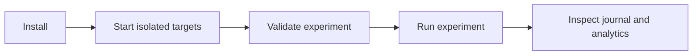

# Quickstart

Get Tumult running in 5 minutes. This is the CLI-only path; for the full
platform (daemon, web UI, approvals, compliance reports) see
[the daemon, lake and web UI](README.md#the-daemon-lake-and-web-ui) in
README.md — or jump straight to the
[platform walkthrough](docs/guides/platform-walkthrough.md) for a guided
click-through of the web UI on the seeded demo stack.



## Install

### Option A: From source

```bash
curl -sSL https://raw.githubusercontent.com/mwigge/tumult/main/install.sh | sh
```

Builds the binary, starts Docker targets, runs a verification experiment. Requires [Rust](https://rustup.rs/) and Docker.

### Option B: Docker (no Rust toolchain needed)

```bash
docker pull ghcr.io/mwigge/tumult:latest        # CLI + MCP server
docker pull ghcr.io/mwigge/tumult-mcp:latest     # MCP server (HTTP entrypoint)
```

Both images contain the CLI, MCP server, bundled providers, examples, and
GameDay support. Run `tumult discover` against the installed image for the
authoritative provider and action inventory.

```bash
# Run CLI commands
docker run --rm ghcr.io/mwigge/tumult discover
docker run --rm ghcr.io/mwigge/tumult --help

# Start MCP server for agent access
docker run -p 3100:3100 --network tumult-e2e \
  -e TUMULT_MCP_TOKEN='replace-with-a-secret' \
  ghcr.io/mwigge/tumult-mcp
```

Without a token the HTTP server binds to loopback only; a bearer token
(`TUMULT_MCP_TOKEN`) is required before it will serve non-loopback clients.

### Option C: Clone and build

```bash
git clone https://github.com/mwigge/tumult.git && cd tumult
cargo build --release -p tumult-cli -p tumult-mcp
```

### 2. Start infrastructure

```bash
make up-targets
```

This starts 5 chaos targets on the `tumult-e2e` Docker network:

| Service | Port | Credentials |
|---------|------|-------------|
| PostgreSQL 16 | localhost:15432 | tumult / tumult_test |
| Redis 7 | localhost:16379 | — |
| Kafka 3.8 | localhost:19092 | — |
| MySQL 8 | localhost:13306 | root / tumult_test |
| SSH Server | localhost:12222 | `make ssh-key` for key |

### 3. Run your first chaos experiment

**Redis resilience test** — verify Redis handles a disruption and recovers:

```bash
tumult run examples/redis-chaos.toon
```

Output:
```
Running experiment: Redis resilience — verify recovery after disruption
Status: Completed
Duration: 297ms
Method steps: 3 executed
Journal written to: journal.toon
```

**PostgreSQL failover** — kill idle connections and verify PG recovers:

```bash
tumult run examples/postgres-failover.toon
```

**Pumba network latency** — inject 200ms latency into a container:

```bash
tumult run examples/pumba-latency.toon
```

**SSH remote stress test** — run stress-ng on a remote host via SSH:

```bash
make ssh-key  # extract test SSH key first
tumult run examples/ssh-remote.toon
```

### 4. Explore your data

```bash
# SQL analytics over all experiments
tumult analyze --query "SELECT title, status, duration_ms FROM experiments ORDER BY started_at_ns DESC"

# Export to Parquet for BI tools
tumult export --format parquet journal.toon

# Generate HTML report
tumult report --format html journal.toon

# Compliance evidence (DORA, NIS2, PCI-DSS, ISO-27001, SOC2, ISO-22301, Basel III)
tumult compliance --framework dora .
```

### 5. See what's available

```bash
# List the providers and actions in this build
tumult discover

# Scaffold your own experiment from a template (self-contained, no Docker)
tumult init
```

### 6. Serve Tumult as tools for AI agents (MCP)

The same chaos actions are exposed over the Model Context Protocol so agents
(Claude Code, and others) can run experiments and query results. Start the
server straight from the CLI — no separate binary needed:

```bash
# Local agents over stdio (default)
tumult mcp serve

# Networked agents over HTTP, with a bearer token
tumult mcp serve --transport http --port 3100 --token "$MCP_TOKEN"
```

`tumult mcp --help` lists the options; the server also exposes a `/health`
endpoint (default: `port + 1`).

### 7. Explore the ChaosGraph knowledge graph

ChaosGraph collapses every accumulated run into a compact node/edge graph.
Previously reachable only through MCP, it now has first-class CLI commands that
read the analytics store (`~/.tumult/lake.duckdb`, or `--store <path>`):

```bash
# List graph nodes of a kind (experiment, fault, service, journal, …)
tumult chaosgraph query --kind fault

# The neighbourhood of one experiment (nodes + edges within N hops)
tumult chaosgraph neighbors --node "exp:Redis resilience — verify recovery after disruption"

# Chaos actions never exercised by a tested run
tumult chaosgraph coverage-gaps --framework dora

# Any command supports --format json
tumult chaosgraph query --kind service --format json
```

## Run a GameDay (full e2e)

One command — starts infrastructure, runs 4 PostgreSQL resilience experiments via MCP, scores results, maps to DORA compliance:

```bash
./scripts/gameday-demo.sh
```

Output:
```
GameDay: Q2 PostgreSQL Resilience Programme
Status: COMPLIANT
Resilience Score: 1.00
  #1 [PASS] PostgreSQL connection kill under load (2197ms)
  #2 [PASS] PostgreSQL container pause — total unavailability (7402ms)
  #3 [PASS] PostgreSQL CPU stress — resource pressure (9331ms)
  #4 [PASS] PostgreSQL memory stress — resource pressure (9305ms)

Compliance: DORA EU 2022/2554 Art. 11, 24, 25 | NIS2
```

The demo script exercises the full pipeline: Agent → MCP HTTP → experiment runner → plugins → Docker targets → DuckDB analytics → compliance mapping.

## Add observability

Start the full stack with SigNoz dashboards:

```bash
./start.sh infra observe
```

Then run experiments with OpenTelemetry tracing:

```bash
OTEL_EXPORTER_OTLP_ENDPOINT=http://localhost:14317 tumult run examples/redis-chaos.toon
```

Open SigNoz at http://localhost:3301 to see traces, metrics, and dashboards.

| Endpoint | What |
|----------|------|
| localhost:3301 | SigNoz UI (traces, metrics, logs) |
| localhost:14317 | OTLP gRPC (send traces here) |
| localhost:18889 | Prometheus metrics (host + APM) |
| localhost:13133 | Collector health check |

## Bring your own target

To test your own service, create an experiment that probes it:

```toon
title: My service health check
description: Verify my-service handles connection loss

tags[1]: my-service

steady_state_hypothesis:
  title: Service responds 200
  probes[1]:
    - name: health-check
      activity_type: probe
      provider:
        type: process
        path: curl
        arguments[6]: "-s", "-o", "/dev/null", "-w", "%{http_code}", "http://localhost:8080/health"
        timeout_s: 5.0
      tolerance:
        type: regex
        pattern: "200"

method[1]:
  - name: kill-dependency
    activity_type: action
    provider:
      type: process
      path: sh
      arguments[2]: "-c", "docker stop my-dependency-container"
      timeout_s: 10.0
    pause_after_s: 5.0

rollbacks[1]:
  - name: restart-dependency
    activity_type: action
    provider:
      type: process
      path: sh
      arguments[2]: "-c", "docker start my-dependency-container"
      timeout_s: 10.0
```

```bash
tumult validate my-experiment.toon  # check syntax
tumult run my-experiment.toon       # execute
```

## Stop everything

```bash
make down
```

## Next steps

- [Full documentation](https://mwigge.github.io/tumult/)
- [Plugin reference](docs/plugins/)
- [Experiment format](docs/reference/)
- [Test protocol](docs/testprotocol.md)
- [Security assessment](docs/security-assessment.md)
