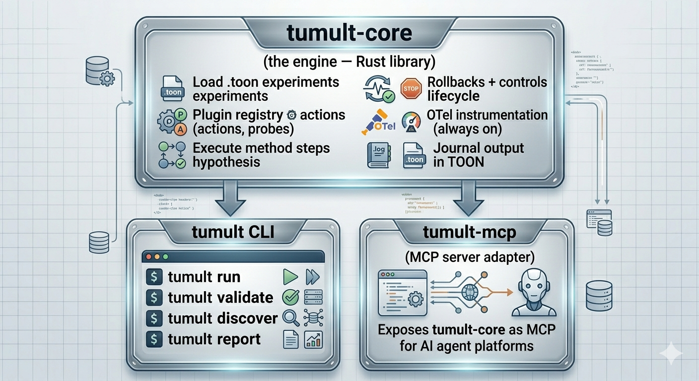
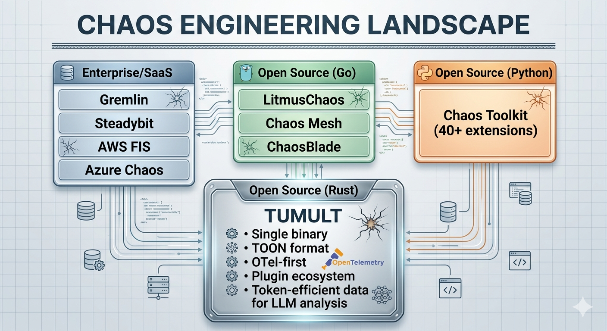

#  Tumult — Rust-Native Chaos Engineering Platform


## What is Tumult?

Tumult is a modern, modular chaos engineering platform written in Rust. It serves as a fast, portable, and inherently observable alternative to Python-based tools like Chaos Toolkit.

Tumult is designed for the modern cloud-native landscape. It doesn't just create disruption; it provides the **native observability** required to understand exactly how systems respond, and the structured data format necessary for modern analytics and automated tooling to analyze those responses at scale.

## Core Concepts (Why Rust-Native?)

Legacy chaos engineering tools are powerful but face significant hurdles in modern production environments: Python runtime overhead, complex dependency deployments, and verbose JSON data structures that are costly and inefficient for advanced analysis.

Tumult solves these issues by being built in Rust:

1. **Speed & Single Binary:** Compiles to a single binary per platform. It executes faster and "just runs" without runtime dependencies.
2. **Observability-First:** Every action, probe, and lifecycle event is emitted as a real OpenTelemetry span with `resilience.*` attributes. Each activity gets its own span with unique trace/span IDs. OTLP gRPC export is built-in.
3. **Data-Driven Analysis:** Tumult uses TOON (Token-Oriented Object Notation) for experiments and journals. Journals flow through Apache Arrow into embedded DuckDB for SQL analytics, and export to Parquet for any data tool. TOON is 40-50% more token-efficient than JSON.

## Table of Contents

- [Architecture](#architecture)
- [Experiment Format & Plugin Model](#experiment-format--plugin-model)
- [Available Plugins](#available-plugins)
- [MCP Server (AI Integration)](#mcp-server-ai-integration)
- [Data-Driven Chaos Engineering](#data-driven-chaos-engineering)
- [OpenTelemetry Observability](#opentelemetry-observability)
- [Security](#security)
- [Hardening](#hardening)
- [Docker Test Infrastructure](#docker-test-infrastructure)
- [Phasing & Roadmap](#phasing--roadmap)
- [Example Experiment](#example-experiment)
- [Quick Start](#quick-start)
- [Direct Comparison to Chaos Toolkit](#direct-comparison-to-chaos-toolkit)
- [Acknowledgements](#acknowledgements)
- [License](#license)

## Architecture

Tumult uses a decoupled engine and adapter layer architecture, allowing the core engine to be orchestrated by a CLI, an API, or any automated orchestration system via the Model Context Protocol (MCP).



### The Chaos Engineering Landscape



## Experiment Format & Plugin Model

### Compatibility

Tumult retains the familiar conceptual model of Chaos Toolkit, allowing you to transfer existing knowledge of:
* Steady-State Hypotheses
* Methods (Sequential and Background steps)
* Probes & Actions
* Controls (Lifecycle Hooks)
* Rollbacks

### TOON Experiments

Experiments are defined in TOON (.toon), replacing verbose JSON with a concise, token-efficient format designed for both humans and advanced tooling.

### Community Plugins: Script-Based

The script-based plugin model enables the community to contribute chaos capabilities **without needing to know Rust**. Community plugins are simply directories containing executable scripts (Bash, Python, etc.) and a TOON manifest declaring their capabilities.

```text
tumult-plugin-kafka/
├── plugin.toon              # declares actions, probes, arguments
├── actions/
│   ├── kill-broker.sh
├── probes/
│   ├── consumer-lag.sh
```

### Native Rust Plugins

Native plugins (for performance-critical or SDK-heavy tasks like kube-rs or cloud provider SDKs) are built directly into the core and enabled via Cargo feature flags.

```bash
cargo install tumult --features kubernetes,aws
```

## Available Plugins

| Plugin | Type | Capabilities |
|--------|------|-------------|
| **tumult-core** | Native (Rust) | Experiment runner, five-phase lifecycle, controls, rollbacks |
| **tumult-otel** | Native (Rust) | OTLP gRPC export, per-activity spans, resilience.* attributes |
| **tumult-analytics** | Native (Rust) | DuckDB embedded SQL, Arrow columnar, Parquet/CSV/IPC export |
| **tumult-baseline** | Native (Rust) | Statistical baseline derivation, percentiles, deviation detection |
| **tumult-ssh** | Native (Rust) | SSH remote execution, key/agent auth, file upload |
| **tumult-kubernetes** | Native (Rust) | Pod delete, node drain, deployment scale, network policy, label selectors |
| **tumult-mcp** | Native (Rust) | MCP server with 11 tools for AI-assisted chaos engineering |
| **tumult-clickhouse** | Native (Rust) | ClickHouse backend — shared storage with SigNoz for cross-correlation |
| **tumult-stress** | Script | CPU/memory/IO stress via stress-ng, utilization probes |
| **tumult-containers** | Script | Docker/Podman kill, stop, pause, resource limits, health probes |
| **tumult-process** | Script | Process kill/suspend/resume by PID/name/pattern, resource probes |
| **tumult-db-postgres** | Script | Kill connections, lock tables, inject latency, exhaust connection pool |
| **tumult-db-mysql** | Script | Kill connections, lock tables |
| **tumult-db-redis** | Script | FLUSHALL, CLIENT PAUSE, DEBUG SLEEP, connection/memory probes |
| **tumult-kafka** | Script | Kill broker, partition broker, add latency, consumer lag probes |
| **tumult-network** | Script | tc netem latency/loss/corruption, DNS block, host partition |
| **tumult-pumba** | Script | Container-scoped network chaos via [Pumba](https://github.com/alexei-led/pumba) — netem delay/loss/duplicate/corrupt/rate, iptables, container kill/pause/stop, stress injection. Cross-platform (works anywhere Docker runs). |

See [docs/plugins/](docs/plugins/) for detailed documentation per plugin.

## MCP Server (AI Integration)

Tumult ships a built-in [Model Context Protocol](https://modelcontextprotocol.io/) server, enabling AI assistants to run, analyze, and create chaos experiments natively.

```bash
# Start the MCP server (stdio transport)
tumult mcp

# With authentication (recommended in production)
TUMULT_MCP_TOKEN=my-secret tumult mcp
```

| MCP Tool | Description |
|----------|-------------|
| `tumult_run_experiment` | Execute an experiment and return the journal |
| `tumult_validate` | Validate experiment syntax and provider support |
| `tumult_analyze` | SQL query over journals via embedded DuckDB |
| `tumult_read_journal` | Read a TOON journal and return contents |
| `tumult_list_journals` | List .toon journal files in a directory |
| `tumult_discover` | List all plugins, actions, and probes |
| `tumult_create_experiment` | Create a new experiment from a template |
| `tumult_query_traces` | Query trace data (trace/span IDs) for observability correlation |
| `tumult_store_stats` | Return persistent store statistics |
| `tumult_analyze_store` | SQL query directly against the persistent DuckDB store |
| `tumult_list_experiments` | List experiment .toon files in a directory |

### Authentication

Set `TUMULT_MCP_TOKEN` to require bearer token authentication on all tool calls (constant-time comparison, no timing attack surface). If unset, the server runs without auth and emits a log warning.

## Data-Driven Chaos Engineering

Tumult is **data-driven by design**. Every experiment produces structured evidence — not just pass/fail, but columnar analytics data that flows through a modern data pipeline.

```
Experiment → TOON Journal → Apache Arrow (columnar) → DuckDB (embedded SQL) → Parquet (export)
```

Every probe result, every action timing, every hypothesis evaluation is captured as structured columnar data — queryable with SQL, exportable as Parquet for any data tool, and token-efficient for LLM analysis.

```bash
# Run experiments — data is captured automatically
tumult run experiment.toon

# Query your experiment data with SQL
tumult analyze journals/ --query "
    SELECT status, count(*) as runs, avg(duration_ms) as avg_ms
    FROM experiments GROUP BY status"

# Export to Parquet — portable to Spark, Polars, pandas, Jupyter
tumult export journal.toon --format parquet
```

**Why this matters:**
- **Transparency** — all experiment evidence is in standard Parquet format, auditable by anyone
- **Reusability** — query across hundreds of experiment runs with SQL, no custom scripts
- **LLM-friendly** — TOON journals are 40-50% fewer tokens than JSON equivalents
- **No infrastructure** — DuckDB is embedded, Arrow is in-memory, Parquet is a file

See [Analytics Guide](docs/guides/analytics-guide.md) for table schemas, SQL examples, and export options.

## OpenTelemetry Observability

Tumult creates **real OpenTelemetry spans** across every module — not just the experiment runner, but SSH, Kubernetes, plugin execution, baseline acquisition, analytics pipeline, MCP dispatch, and ClickHouse storage.

```
resilience.experiment           (root span — tumult-core)
├── resilience.hypothesis.before
│   └── resilience.probe        (per probe)
├── resilience.action           (per action)
│   ├── ssh.connect / ssh.execute   (tumult-ssh)
│   ├── k8s.pod.delete / k8s.node.drain  (tumult-kubernetes)
│   └── script.execute          (tumult-plugin)
├── resilience.hypothesis.after
│   └── resilience.probe
├── resilience.rollback
├── baseline.acquire            (tumult-baseline)
├── resilience.analytics.ingest (tumult-analytics → DuckDB or ClickHouse)
│   ├── resilience.analytics.query
│   └── resilience.analytics.export
└── mcp.tool.call               (tumult-mcp)
```

Every span carries structured events per [OTel semantic conventions](https://opentelemetry.io/docs/specs/semconv/general/events/): `journal.ingested`, `script.completed`, `drain.completed`, `tolerance.derived`, `anomaly.detected`.

### Dual-Mode Analytics (DuckDB + ClickHouse)

```bash
# Default: DuckDB embedded (works offline, zero dependencies)
tumult run experiment.toon

# With SigNoz: ClickHouse shared storage for cross-correlation
TUMULT_CLICKHOUSE_URL=http://localhost:8123 tumult run experiment.toon
```

When ClickHouse mode is active, experiment data lives in the same database as SigNoz traces/metrics/logs, enabling queries like:

```sql
SELECT e.title, e.status, t.serviceName
FROM tumult.experiments e
JOIN signoz_traces.signoz_index_v2 t ON e.experiment_id = t.traceID
```

## Observability Platform

Tumult ships a composable Docker observability stack powered by [SigNoz](https://signoz.io) (MIT licensed) — traces, metrics, and logs in a single UI.

```bash
# Full platform: chaos targets + SigNoz observability
make up
open http://localhost:13301    # SigNoz UI

# Chaos targets only (PostgreSQL, Redis, Kafka, SSH)
make up-targets

# Observability only (deploy alongside existing infra)
make up-observe

# Classic stack (Jaeger + Prometheus + Grafana)
make up-classic
```

The OTel Collector automatically scrapes all services:

| Source | Receiver | Key Metrics |
|--------|----------|-------------|
| PostgreSQL | `postgresql` | connections, rows, locks, WAL |
| Redis | `redis` | clients, memory, ops/sec |
| Kafka | `kafkametrics` | brokers, topics, consumer lag |
| Docker | `docker_stats` | CPU, memory, network per container |
| Host | `hostmetrics` | CPU, memory, disk, network |
| Tumult | OTLP | experiment spans, analytics gauges, script counters |

## Docker Test Infrastructure

Tumult provides composable Docker Compose stacks for testing. All ports use the `1xxxx` range.

```bash
cd docker/
docker compose -f docker-compose.yml -f docker-compose.observability.yml up -d
docker compose -f docker-compose.yml -f docker-compose.observability.yml ps
```

| Stack | Service | Port | Purpose |
|-------|---------|------|---------|
| Targets | PostgreSQL 16 | 15432 | Database chaos testing |
| Targets | Redis 7 | 16379 | Cache chaos testing |
| Targets | Kafka 3.8 (KRaft) | 19092 | Message broker chaos testing |
| Targets | SSH Server | 12222 | Remote execution testing |
| Observability | **Tumult OTel Collector** | 14317 | Custom-built OTLP gateway (traces, metrics, logs, Arrow) |
| Observability | ClickHouse | 18123 | Persistent trace/metric storage |
| Observability | Prometheus metrics | 18889 | Host + APM span metrics |
| Observability | SigNoz | 13301 | Unified traces + metrics + logs dashboard |
| Classic (opt) | Jaeger | 16686 | Trace visualization (`--profile classic`) |
| Classic (opt) | Grafana | 13000 | Dashboards (`--profile classic`) |

The **Tumult OTel Collector** is a purpose-built distribution compiled with the [OpenTelemetry Collector Builder](https://opentelemetry.io/docs/collector/extend/ocb/). It includes OTLP + Arrow receivers, ClickHouse + file + Prometheus exporters, host metrics collection, and a span-to-metrics connector for APM RED metrics. See [docker/tumult-collector/](docker/tumult-collector/) for build config.

## Platform Test Protocol

Full functional validation of all platform components is documented in [docs/testprotocol.md](docs/testprotocol.md).

**166 tests** across 22 categories covering CLI, experiment engine, TOON format, plugins (10 including [Pumba](https://github.com/alexei-led/pumba)), Arrow/DuckDB pipeline, OpenTelemetry observability, custom OTel Collector, SigNoz, ClickHouse, containers, SSH, baseline statistics, analytics/reporting, compliance frameworks, MCP server, and end-to-end scenarios.

| Category | Tests | Pass |
|----------|-------|------|
| CLI + Core Engine | 17 | 17 |
| TOON Format + Plugins | 8 | 8 |
| Script Plugins (10 plugins, 45 actions) | 15 | 13 |
| Arrow + DuckDB Analytics | 12 | 12 |
| OpenTelemetry (7 canonical spans) | 10 | 10 |
| Custom OTel Collector (build + signals) | 10 | 9 |
| Pumba Network Chaos (netem, iptables, container) | 15 | 15 |
| Containers + SSH + Baseline | 16 | 15 |
| Analytics, Reporting, Compliance (7 frameworks) | 14 | 14 |
| End-to-End Pipelines | 10 | 10 |
| Unit Tests (562 Rust tests) | 7 | 7 |
| **Total** | **166** | **141 (85%)** |

Zero failures. 5 skips (Kubernetes, k6). 12 infrastructure issues (SigNoz collector cluster config, Kafka listener). See the [full test protocol](docs/testprotocol.md) for detailed results per test.

See [docker/README.md](docker/README.md) for detailed setup instructions.

## Phasing & Roadmap

| Phase | Scope | Status |
|-------|-------|--------|
| **0 — Foundation** | tumult-core, tumult-plugin, tumult-cli, tumult-otel | Done |
| **1 — Essential Plugins** | SSH, stress, containers, process, Kubernetes | Done |
| **2 — Analytics & Data** | DuckDB, Arrow, Parquet export, trend analysis, databases, Kafka, network | Done |
| **3 — Automation** | MCP server (11 tools), AI-assisted chaos engineering | Done |
| **4 — Persistent Analytics** | DuckDB + ClickHouse dual-mode, SigNoz integration, backup/restore | Done |
| **5 — Regulatory Compliance** | DORA (EU 2022/2554), NIS2, PCI-DSS evidence reporting | Done |
| **6 — Hardening** | SSH session pool, MCP auth, streaming baseline, experiment templates, signal handlers, audit log, proptest, fuzz | Done |
| **7 — Infrastructure** | SigNoz observability platform, Docker Compose stacks | Done |
| **8 — Deployment** | AQE integration, GameDay orchestration, dashboards | Planned |

## Security

Tumult is built entirely in safe Rust — **zero `unsafe` blocks** across all 11 crates. The full security posture is documented in [docs/security-assessment.md](docs/security-assessment.md) and vulnerability reporting in [SECURITY.md](SECURITY.md).

| Area | Status |
|------|--------|
| Unsafe code (our crates) | **0 blocks** — completely memory-safe |
| `.unwrap()` in production | **0 calls** — all error paths use `?` or `.context()` |
| SQL injection | **0 vectors** — no string-formatted queries, Arrow record batch inserts |
| Command injection | **Mitigated** — null-byte validation, env var passing (not shell interpolation) |
| Hardcoded credentials | **0** — secrets resolved from environment at runtime |
| cargo-audit | **0 HIGH/CRITICAL** — 5 low-severity transitive warnings (unmaintained crates) |
| Dependency tree | **675 crates** scanned against [RustSec Advisory Database](https://rustsec.org/) on every commit |

Script plugins execute shell scripts as subprocesses with timeout enforcement (`kill_on_drop`), argument validation, and captured stdout/stderr. This is a trust boundary by design — same model as kubectl plugins or Git hooks. See the [security assessment](docs/security-assessment.md) for the full analysis including integer cast review, deserialization surface, and supply chain audit.

## Hardening

Hardening focused on production-readiness, test coverage, and security hardening.

### SSH Session Pool

`tumult-ssh` now maintains a connection pool (`SshPool`) that reuses SSH sessions across multiple actions in an experiment. This eliminates repeated TCP + SSH handshake overhead for experiments with many remote steps:

```rust
let pool = SshPool::new();
let session = pool.get_or_connect(&config).await?;
session.exec("systemctl stop myservice").await?;
// Next call to the same host reuses the connection:
session.exec("systemctl start myservice").await?;
```

### Experiment Templates

Experiments support `${VARIABLE}` substitution in titles and activity names, allowing a single template to be reused across environments:

```bash
tumult run template.toon --var env=staging --var cluster=eu-west-1
```

Undefined variables cause a hard error at startup (not silent).

### Streaming Baseline Acquisition

`tumult-baseline` exposes `AcquisitionStream` for incremental sample collection. This is used by the runner to start computing statistics as soon as warmup ends, without buffering the full sample set.

### MCP Authentication

The MCP server supports opt-in bearer token authentication via `TUMULT_MCP_TOKEN`. Token comparison uses constant-time equality (`subtle` crate) to prevent timing attacks. A Semaphore(10) rate-limits concurrent tool calls.

### Audit Log

Every experiment run emits structured audit events (`experiment.started`, `experiment.completed`) as `tracing::info!` with `experiment_id`, `title`, `status`, and `duration_ms` fields. These flow into log aggregators (Loki, Elasticsearch) correlated with the OTel trace.

### Signal Handlers

`tumult run` wires `SIGINT`/`SIGTERM` to a `CancellationToken`. In-flight activities complete their current step, rollbacks execute, and the journal is written before exit. The experiment status is recorded as `Interrupted`.

### Trace Context Propagation

Script plugins receive `TRACEPARENT` and `TRACESTATE` environment variables, allowing subprocess-emitted OTel spans to attach as children of the `script.execute` span without any changes to existing scripts.

### Test Infrastructure

- **566 tests** across the workspace (up from 391)
- **Property-based tests** (`proptest`) for all statistical functions in `tumult-baseline`
- **Fuzz target** for experiment TOON deserialization (`tumult-core/fuzz/`)
- **`tumult-test-utils` crate** — shared `MockPlugin`, `EventLog`, and experiment builders for integration tests
- **Criterion benchmarks** for baseline statistics (`tumult-baseline/benches/`)

## Example Experiment

Here's a complete experiment in TOON that validates database failover with automatic reconnection:

```toon
title: Database failover validates automatic reconnection
description: Kill PostgreSQL primary connections and verify app reconnects

tags[2]: database, resilience

configuration:
  db_host:
    type: env
    key: DATABASE_HOST

estimate:
  expected_outcome: recovered
  expected_recovery_s: 15.0
  expected_degradation: moderate
  expected_data_loss: false
  confidence: high
  rationale: Tested monthly with consistent recovery
  prior_runs: 5

baseline:
  duration_s: 120.0
  warmup_s: 15.0
  interval_s: 2.0
  method: mean_stddev
  sigma: 2.0
  confidence: 0.95

steady_state_hypothesis:
  title: Application responds healthy
  probes[1]:
    - name: health-check
      activity_type: probe
      provider:
        type: http
        method: GET
        url: http://localhost:8080/health
        timeout_s: 5.0
      tolerance:
        type: exact
        value: 200

method[1]:
  - name: kill-db-connections
    activity_type: action
    provider:
      type: native
      plugin: tumult-db
      function: terminate_connections
      arguments:
        database: myapp
    pause_after_s: 5.0
    background: false

rollbacks[1]:
  - name: restore-connections
    activity_type: action
    provider:
      type: native
      plugin: tumult-db
      function: reset_connection_pool
    background: false

regulatory:
  frameworks[1]: DORA
  requirements[1]:
    - id: DORA-Art24
      description: ICT resilience testing
      evidence: Recovery within RTO
```

## Quick Start

**One-command setup** (requires Rust + Docker):

```bash
git clone https://github.com/mwigge/tumult.git && cd tumult && ./install.sh
```

This builds the binary, starts Docker targets, and runs a verification experiment. Then:

```bash
tumult run examples/redis-chaos.toon       # break Redis, watch it recover
tumult run examples/postgres-failover.toon  # kill PG connections
tumult run examples/pumba-latency.toon      # inject 200ms network latency
tumult analyze --query "SELECT title, status, duration_ms FROM experiments"
```

See **[QUICKSTART.md](QUICKSTART.md)** for the full guided walkthrough including observability setup, SSH experiments, compliance reports, and bring-your-own-target instructions.

### Manual install

**From GitHub Releases** (pre-built binaries for 6 targets):

Download the latest release from [Releases](https://github.com/mwigge/tumult/releases) and place the binary on your PATH.

**From source:**

```bash
git clone https://github.com/mwigge/tumult.git
cd tumult
cargo build --release
cp target/release/tumult /usr/local/bin/
```

### Usage

```bash
# Create a new experiment
tumult init

# Validate an experiment
tumult validate experiment.toon

# Dry run — see the execution plan without running
tumult run experiment.toon --dry-run

# Run the experiment
tumult run experiment.toon

# Run with template variable substitution
tumult run template.toon --var env=staging --var cluster=eu-west-1

# Run with custom rollback strategy
tumult run experiment.toon --rollback-strategy always

# List discovered plugins
tumult discover

# Analyze experiment results with SQL
tumult analyze journal.toon
tumult analyze journals/ --query "SELECT status, count(*) FROM experiments GROUP BY status"

# Persistent store management
tumult store stats
tumult store backup --output ~/tumult-backup
tumult store purge --older-than-days 90

# Cross-run trend analysis
tumult trend journals/ --metric resilience_score

# Regulatory compliance report
tumult compliance journals/ --framework dora

# Export to Parquet for external tools
tumult export journal.toon --format parquet

# Start MCP server (with optional auth)
TUMULT_MCP_TOKEN=my-secret tumult mcp
```

See [CLI Reference](docs/guides/cli-reference.md) for full command documentation.

### Development (Makefile)

The root `Makefile` provides all development and infrastructure commands:

```bash
make up              # Full platform: chaos targets + SigNoz observability
make up-targets      # Chaos targets only (PostgreSQL, Redis, Kafka, SSH)
make up-observe      # Observability only (SigNoz + OTel Collector)
make up-classic      # Classic stack (Jaeger + Prometheus + Grafana)
make down            # Stop everything
make status          # Container health check
make ssh-key         # Extract SSH test key to /tmp/tumult-test-key
make test            # Run all Rust tests
make e2e             # Run e2e tests against Docker infra
make lint            # cargo fmt --check + clippy
make build           # Build release binary
make clean           # cargo clean + docker compose down
```

## Direct Comparison to Chaos Toolkit

| Chaos Toolkit Component | Tumult Equivalent | Key Advantage |
|-------------------------|-------------------|---------------|
| `chaostoolkit` (CLI) | `tumult-cli` | Single binary, no runtime dependencies |
| `chaostoolkit-lib` (engine) | `tumult-core` | Rust speed, five-phase lifecycle with baseline |
| Python extensions | Script plugins + Native Rust plugins | Community plugins without Rust; native for performance |
| JSON experiments | TOON experiments | 40-50% fewer tokens, human-readable |
| opentracing control | Built-in OTel (per-activity spans) | Real spans with `resilience.*` attributes, always on |
| Manual analysis | `tumult-analytics` (DuckDB + Arrow) | Embedded SQL over journals, Parquet export |
| No AI integration | `tumult-mcp` (11 MCP tools) | AI assistants run experiments natively |
| Ad-hoc infrastructure | Docker Compose e2e stack | One command to spin up test services |

---

## Acknowledgements

Tumult is inspired by and builds upon the concepts pioneered by the [Chaos Toolkit](https://chaostoolkit.org/) project. Chaos Toolkit's experiment model — steady-state hypothesis, method, rollbacks, controls, and declarative experiment format — established the foundational patterns that Tumult reimagines in Rust.

We are grateful to [Russ Miles](https://github.com/russmiles), the ChaosIQ team, and the entire Chaos Toolkit community for making chaos engineering accessible and standardized.

Tumult also leverages:
- [TOON](https://github.com/toon-format/spec) by Johann Schopplich — token-efficient data format
- [Tokio](https://tokio.rs/) — async runtime powering all concurrent execution
- [OpenTelemetry](https://opentelemetry.io/) — vendor-neutral observability standard
- [Apache Arrow](https://arrow.apache.org/) + [DuckDB](https://duckdb.org/) — in-memory columnar analytics
- [Pumba](https://github.com/alexei-led/pumba) by Alexei Ledenev — container-scoped network chaos and fault injection for Docker
- [SigNoz](https://signoz.io/) — open-source observability platform (traces, metrics, logs)
- [Agentic QE Framework](https://agentic-qe.dev/) by Dragan Spiridonov — autonomous quality engineering

---

## License

Licensed under the Apache License, Version 2.0. See [LICENSE](LICENSE) for details.

Copyright 2026 Tumult Contributors.
