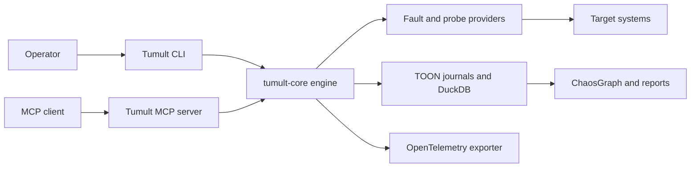

# Tumult

[](https://github.com/mwigge/tumult/actions/workflows/ci.yml)
[](https://github.com/mwigge/tumult/actions/workflows/coverage.yml)


Tumult is a Rust-native chaos engineering platform for running observable,
repeatable resilience experiments from a CLI or Model Context Protocol (MCP)
client.


```mermaid
flowchart LR
    accTitle: Tumult architecture and evidence flow
    accDescr: Operators and MCP clients submit experiments to the Tumult engine, which calls fault providers and writes journals, analytics, graph data, and telemetry.
    operator[Operator] --> cli[Tumult CLI]
    client[MCP client] --> mcp[Tumult MCP server]
    cli --> engine[tumult-core engine]
    mcp --> engine
    engine --> providers[Fault and probe providers]
    providers --> targets[Target systems]
    engine --> evidence[TOON journals and DuckDB]
    evidence --> reports[ChaosGraph and reports]
    engine --> otel[OpenTelemetry exporter]
```

## Quick start

Prerequisites: Rust 1.91.1 or newer and Docker with Compose.

```bash
git clone https://github.com/mwigge/tumult.git && cd tumult
cargo build --release -p tumult-cli
docker compose -f docker/docker-compose.yml up -d --wait postgres redis kafka mysql sshd
target/release/tumult validate examples/redis-chaos.toon
target/release/tumult run examples/redis-chaos.toon
```

The run writes a TOON journal and, unless disabled, ingests it into the embedded
DuckDB analytics store. Follow the [guided walkthrough](QUICKSTART.md) for
analysis, observability, GameDays, and MCP usage.

## Capabilities

- A five-phase experiment lifecycle with steady-state probes, fault actions,
  controls, recovery sampling, and rollback.
- Script plugins for containers, databases, Kafka, load testing, network
  faults, processes, Pumba, stress, and time-related failure modes.
- Native Rust executors for SSH, userspace TCP fault injection, Kubernetes,
  cloud APIs, and Windows.
- TOON journals, Arrow conversion, DuckDB analytics, and Parquet, CSV, JSON,
  and Arrow IPC export.
- OpenTelemetry traces and metrics across experiment execution, plugins,
  analytics, SSH, Kubernetes, MCP, and agentic test paths.
- Statistical baselines, cross-run trends, GameDay orchestration, compliance
  evidence mapping, ChaosGraph, service topology, and policy-gated autopilot.
- Deterministic and live-proxy fault injection for AI agents, plus adapters for
  Claude Code and Codex.

Run `tumult discover` to obtain the authoritative plugin and action catalog for
the installed build.

## Krönika

*The chronicle of your resilience work.*

Krönika is the graphical analytics & reporting platform served by the
`tumultd` daemon — imported from the kronika project and folded into this
repository (see `docs/adr/ADR-006-kronika-stack.md`). Tumult is the engine
that executes experiments; Krönika is what their telemetry accumulates into.

- **Automatic ingest** — OTLP/gRPC (`:4317`, tumult's exporter) and
  OTLP/HTTP protobuf (`:4318`, `/v1/*`) on one daemon, plus manual import of
  CSV files and tumult journal JSON (`tumultd import <file>`).
- **Embedded DuckDB store + parquet lake** — wide,
  ClickHouse-exporter-aligned tables; incremental, watermark-driven export
  to immutable day-partitioned parquet (`KRONIKA_LAKE_DIR`,
  `KRONIKA_LAKE_INTERVAL`, `POST /api/lake/export`), with optional retention
  (`KRONIKA_RETENTION_DAYS`, default keep forever; the manual-evidence
  tables are never deleted). Write-once parquet plus the hash-chained audit
  trail form a WORM-shaped evidence trail (ADR-010).
- **Semantic metrics layer** — YAML metric views (`metrics/*.yaml`) compiled
  to strictly validated SQL.
- **Compliance-grade reports** — R1 executive resilience digest (with
  org-hierarchy rollups), R3 per-run game-day report and an R2 evidence pack
  (DORA/NIS2/ISO 27001/SOC 2), rendered as embedded-Typst PDFs plus
  print-HTML previews, with Gremlin-style resilience scoring and a draft →
  verified manual-evidence lifecycle (reviewer ≠ enterer, append-only
  hash-chained audit).
- **Web UI + query API** — a SvelteKit SPA embedded into the `tumultd`
  binary (Overview, experiment waterfall drill-down, Logs, Traces, Metrics,
  Topology, Ask, Reports) backed by a read-only JSON API under `/api/*`,
  including a guarded NL→SQL ask path (`tumult_intelligence::sql_guard`).

Try it: `docker compose -f docker/docker-compose.kronika.yml up -d --build`,
then open http://localhost:14318/. The compose stack builds the UI and the
`tumultd` binary in Docker, seeds a demo experiment suite plus manual-evidence
records, and exports a report into `demo-out/`. To build locally instead, run
`cd web && npm ci && npm run build` before compiling `tumultd` — the binary
embeds `web/build/`.

## CLI

```bash
tumult validate experiment.toon
tumult run experiment.toon
tumult analyze --query "SELECT title, status FROM experiments"
tumult compliance --framework dora .
tumult gameday run gamedays/q2-postgres-resilience.gameday.toon
tumult topology map
tumult autopilot once --policy ~/.tumult/autopilot.toml
```

See the [CLI reference](docs/guides/cli-reference.md) and
[experiment format reference](docs/guides/experiment-format.md).

## MCP server

Tumult exposes 40 tools over stdio or streamable HTTP:

```bash
# Stdio
tumult-mcp

# HTTP, loopback only when authentication is not configured
tumult-mcp --transport http --port 3100

# Authenticated HTTP
TUMULT_MCP_TOKEN='replace-with-a-secret' tumult-mcp --transport http --port 3100
```

| Area | Tools |
|---|---|
| Experiments | `tumult_run_experiment`, `tumult_validate`, `tumult_discover`, `tumult_create_experiment`, `tumult_list_experiments` |
| Journals and analytics | `tumult_read_journal`, `tumult_list_journals`, `tumult_analyze`, `tumult_analyze_store`, `tumult_store_stats`, `tumult_query_traces`, `tumult_report`, `tumult_compliance`, `tumult_trend` |
| GameDays | `tumult_gameday_run`, `tumult_gameday_analyze`, `tumult_gameday_create`, `tumult_gameday_list` |
| Intelligence | `tumult_recommend`, `tumult_coverage`, `tumult_agents`, `tumult_fault_catalog`, `tumult_scaffold_experiment` |
| Agentic testing | `tumult_agentic_list_scenarios`, `tumult_agentic_smoke`, `tumult_agentic_run_experiment` |
| ChaosGraph | `tumult_chaosgraph_query`, `tumult_chaosgraph_neighbors`, `tumult_chaosgraph_coverage_gaps`, `tumult_chaosgraph_cypher` |
| Topology | `tumult_topology_import`, `tumult_topology_map`, `tumult_compliance_lineage`, `tumult_recommend_injection` |
| Autopilot | `tumult_autopilot_run`, `tumult_autopilot_status`, `tumult_autopilot_respond`, `tumult_autopilot_export`, `tumult_autopilot_notify` |
| Access | `tumult_whoami` |

Thirty tools return structured content with an advertised output schema. Every
tool declares MCP safety annotations. Read-only tools require the `viewer` role;
writers and fault executors require `operator`. The destructive tools are four:
`tumult_run_experiment`, `tumult_gameday_run`, `tumult_autopilot_run` (when
`execute=true`), and `tumult_autopilot_respond` (when `approve=true`).

See the [MCP guide](docs/guides/mcp-guide.md) for configuration, resource URIs,
authentication, pagination, schemas, and client examples.

## Configuration

| Variable | Purpose |
|---|---|
| `OTEL_EXPORTER_OTLP_ENDPOINT` | OTLP endpoint for traces and metrics. |
| `TUMULT_LAKE_PATH` | Override the persistent DuckDB store path (default `~/.tumult/lake.duckdb`). |
| `TUMULT_PLUGIN_PATH` | Add script-plugin discovery directories. |
| `TUMULT_MCP_TOKEN` | Configure one MCP operator bearer token. |
| `TUMULT_MCP_AUTH_CONFIG` | Configure multiple viewer/operator tokens. |
| `TUMULT_TRACE_UI_BASE` | Add trace links to generated reports. |
| `TUMULT_CLICKHOUSE_URL` | Enable ClickHouse/SigNoz correlation. |
| `CLAUDE_CODE_BIN`, `CODEX_BIN` | Override local agent adapter binaries. |

Provider-specific credentials use their standard environment variables. Tumult
does not store those credentials in journals.

## Safety and evidence scope

Chaos actions are intentionally disruptive. Review every experiment, target,
rollback, guard, and credential scope before using Tumult outside an isolated
environment. MCP HTTP binds without authentication are restricted to loopback.

Compliance reports are evidence summaries, not legal or audit attestations.
Framework mappings and their evidence strength are documented in the
[regulatory mapping](docs/regulatory-mapping.md).

Security issues should be reported through
[GitHub private vulnerability reporting](https://github.com/mwigge/tumult/security/advisories/new).
See [SECURITY.md](SECURITY.md) for the supported-version policy.

## Documentation

- [Quickstart](QUICKSTART.md)
- [Guides](docs/guides/index.md)
- [Plugin reference](docs/plugins/index.md)
- [Architecture decisions](docs/adr/index.md)
- [Data lifecycle](docs/data-lifecycle.md)
- [Security assessment](docs/security-assessment.md)
- [Verification protocol](docs/testprotocol.md)

## Contributing

Before submitting a change, run:

```bash
cargo fmt --all -- --check
cargo clippy --all-targets --all-features -- -D warnings -W clippy::pedantic
cargo test --workspace
cargo audit && cargo deny check && cargo machete --with-metadata
```

Keep commit messages focused on delivered behavior and evidence. Do not include
development-tool or review-process metadata in commit messages.

## License

Apache-2.0. See [LICENSE](LICENSE) and [NOTICE](NOTICE).
