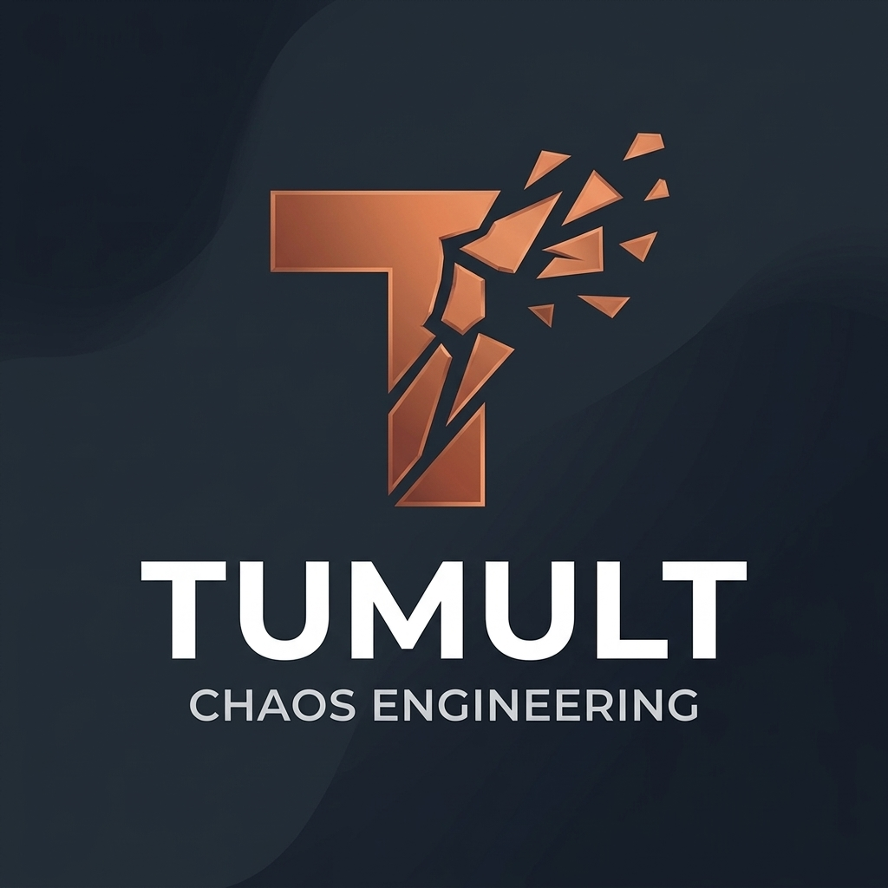
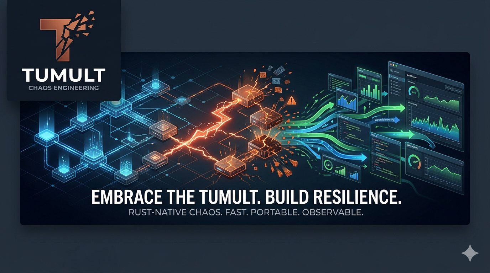
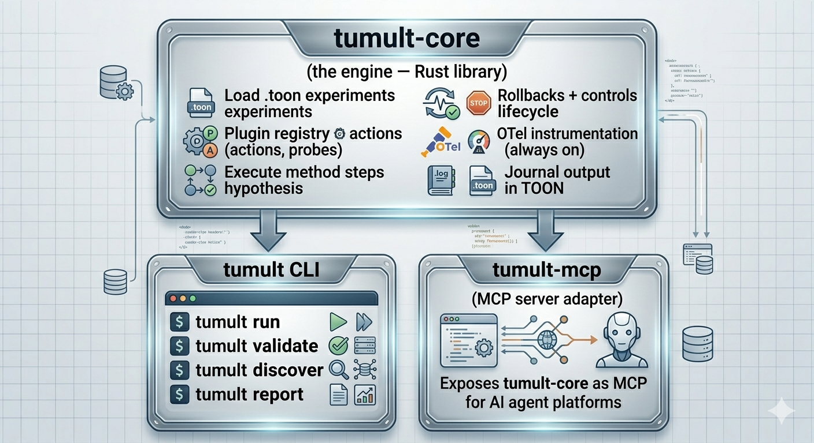
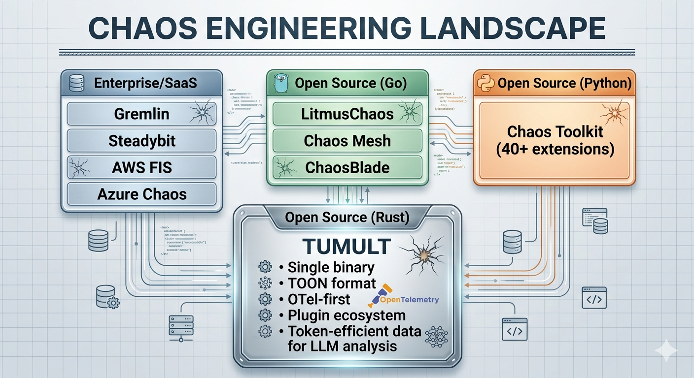
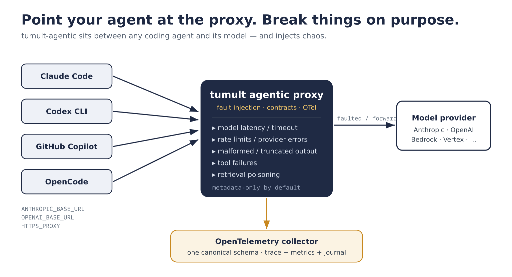
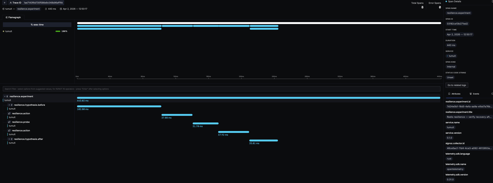

#  Tumult — Rust-Native Chaos Engineering Platform




## What is Tumult?

Tumult is a modern, modular chaos engineering platform written in Rust. It serves as a fast, portable, and inherently observable alternative to Python-based tools like Chaos Toolkit.

Tumult is designed for the modern cloud-native landscape. It doesn't just create disruption; it provides the **native observability** required to understand exactly how systems respond, and the structured data format necessary for modern analytics and automated tooling to analyze those responses at scale. Every result flows into a structured data pipeline — token-efficient formats, embedded SQL analytics, and OpenTelemetry traces — making the platform as readable by LLMs and data tools as it is by engineers.

### Try it

```bash
curl -sSL https://raw.githubusercontent.com/mwigge/tumult/main/install.sh | sh
```

One command. Builds the binary, starts Docker infrastructure, runs a verification experiment. Requires [Rust](https://rustup.rs/) and [Docker](https://docs.docker.com/get-docker/).

Then run your first chaos experiment:

```bash
tumult run examples/redis-chaos.toon
```

### Run a full GameDay (E2E)

One script — starts infrastructure, runs 4 PostgreSQL resilience experiments via MCP, scores results, maps to DORA compliance:

```bash
./scripts/gameday-demo.sh
```

```
GameDay: Q2 PostgreSQL Resilience Programme
Status: COMPLIANT
Resilience Score: 1.00
  #1 [PASS] PostgreSQL connection kill under load
  #2 [PASS] PostgreSQL container pause — total unavailability
  #3 [PASS] PostgreSQL CPU stress — resource pressure
  #4 [PASS] PostgreSQL memory stress — resource pressure

Compliance: DORA EU 2022/2554 Art. 11, 24, 25 | NIS2
```

See **[QUICKSTART.md](QUICKSTART.md)** for the full guided walkthrough, or watch the **[interactive demo](https://tumult.rs/#demo-player)** on the website.

<details>
<summary><strong>Demo: validate → run → analyze → compliance (click to expand)</strong></summary>

```
❯ tumult validate examples/redis-chaos.toon
Experiment: Redis resilience — verify recovery after disruption
Method steps: 3 | Hypothesis: Redis responds to ping (1 probes)
Validation passed.

❯ tumult run examples/redis-chaos.toon
Running experiment: Redis resilience — verify recovery after disruption
INFO experiment.completed status=Completed duration_ms=314 deviations=0
Status: Completed | Duration: 314ms | Method steps: 3 executed
Journal written to: journal.toon

❯ tumult analyze --query "SELECT title, status, duration_ms FROM experiments"
title                                      status     duration_ms
─────────────────────────────────────────  ─────────  ───────────
Redis resilience — verify recovery         completed  314
PostgreSQL failover — kill connections     completed  241
Pumba network latency injection            completed  12787
SSH remote execution — stress test         completed  3385

❯ tumult compliance --framework dora .
=== DORA — Digital Operational Resilience Act (EU 2022/2554) ===
Success rate: 100.0% | Overall: COMPLIANT
Source: https://eur-lex.europa.eu/eli/reg/2022/2554/oj

❯ tumult store stats
Experiments: 47 | Activities: 142 | File size: 2.76 MB
```
</details>

## Core Concepts (Why Rust-Native?)

Legacy chaos engineering tools are powerful but face significant hurdles in modern production environments: Python runtime overhead, complex dependency deployments, and verbose JSON data structures that are costly and inefficient for advanced analysis.

Tumult solves these issues by being built in Rust:

1. **Speed & Single Binary:** Compiles to a single binary per platform. It executes faster and "just runs" without runtime dependencies.
2. **Observability-First:** Every action, probe, and lifecycle event is emitted as a real OpenTelemetry span with `resilience.*` attributes. Each activity gets its own span with unique trace/span IDs. OTLP gRPC export is built-in.
3. **Data-Driven Analysis:** Tumult uses TOON (Token-Oriented Object Notation) for experiments and journals. Journals flow through Apache Arrow into embedded DuckDB for SQL analytics, and export to Parquet for any data tool. TOON is 40-50% more token-efficient than JSON.

## Table of Contents

- [Architecture](#architecture)
- [Experiment Format & Plugin Model](#experiment-format--plugin-model)
- [Available Plugins](#available-plugins)
- [MCP Server (AI Integration)](#mcp-server-ai-integration)
- [Agentic Fault Injection](#agentic-fault-injection)
- [Data-Driven Chaos Engineering](#data-driven-chaos-engineering)
- [Load Testing During Chaos](#load-testing-during-chaos)
- [GameDay Orchestration](#gameday-orchestration)
- [OpenTelemetry Observability](#opentelemetry-observability)
- [Security](#security)
- [Hardening](#hardening)
- [Docker Images](#docker-images)
- [Local End-to-End Environment](#local-end-to-end-environment)
- [Phasing & Roadmap](#phasing--roadmap)
- [Example Experiment](#example-experiment)
- [Quick Start](#quick-start)
- [Direct Comparison to Chaos Toolkit](#direct-comparison-to-chaos-toolkit)
- [Acknowledgements](#acknowledgements)
- [License](#license)

## Architecture

Tumult uses a decoupled engine and adapter layer architecture, allowing the core engine to be orchestrated by a CLI, an API, or any automated orchestration system via the Model Context Protocol (MCP).



### The Chaos Engineering Landscape



## Experiment Format & Plugin Model

### Compatibility

Tumult retains the familiar conceptual model of Chaos Toolkit, allowing you to transfer existing knowledge of:
* Steady-State Hypotheses
* Methods (Sequential and Background steps)
* Probes & Actions
* Controls (Lifecycle Hooks)
* Rollbacks

### TOON Experiments

Experiments are defined in TOON (.toon), replacing verbose JSON with a concise, token-efficient format designed for both humans and advanced tooling.

### Community Plugins: Script-Based

The script-based plugin model enables the community to contribute chaos capabilities **without needing to know Rust**. Community plugins are simply directories containing executable scripts (Bash, Python, etc.) and a TOON manifest declaring their capabilities.

```text
tumult-plugin-kafka/
├── plugin.toon              # declares actions, probes, arguments
├── actions/
│   ├── kill-broker.sh
├── probes/
│   ├── consumer-lag.sh
```

### Native Rust Plugins

Native plugins (for performance-critical or SDK-heavy tasks like kube-rs or cloud provider SDKs) are compiled into the binary. Each native crate implements the `NativeExecutor` trait from `tumult-plugin` and is registered in a `NativeExecutorRegistry` — the CLI is a pure composition root that wires the registry together. Five native plugins are registered today: `tumult-ssh` (1 function), `tumult-net` (7 functions), `tumult-kubernetes` (10 functions), `tumult-cloud` (9 functions), and `tumult-windows` (3 functions). Referencing an unknown plugin or function fails with a clear error listing what is available.

**Windows-native faults** — `tumult-windows` injects `process_kill`, `cpu_stress`, and `network_blackhole` on Windows hosts, the fault domain the Kubernetes-centric OSS tools (Chaos Mesh, LitmusChaos) don't cover. Validated live against a real Windows 11 guest. See the [Windows Faults guide](docs/guides/windows-faults.md).

```toon
provider:
  type: native
  plugin: tumult-ssh
  function: execute
  arguments:
    host: db-primary.example.com
    user: ops
    command: systemctl restart postgresql
    host_key_policy: verify   # default; also trust-on-first-use, accept-any
```

## Available Plugins

| Plugin | Type | Capabilities |
|--------|------|-------------|
| **tumult-core** | Native (Rust) | Experiment runner, five-phase lifecycle, controls, rollbacks |
| **tumult-otel** | Native (Rust) | OTLP gRPC export, per-activity spans, resilience.* attributes |
| **tumult-analytics** | Native (Rust) | DuckDB embedded SQL, Arrow columnar, Parquet/CSV/IPC export |
| **tumult-baseline** | Native (Rust) | Statistical baseline derivation, percentiles, deviation detection |
| **tumult-ssh** | Native (Rust) | SSH remote execution, key/agent auth, file upload, host-key verification (`verify` default, `trust-on-first-use`, `accept-any`) |
| **tumult-kubernetes** | Native (Rust) | Pod delete, node drain, deployment scale, network policy, label selectors |
| **tumult-net** | Native (Rust) | Privilege-free userspace TCP chaos proxy (via [`tokio-netem`](https://crates.io/crates/tokio-netem)) — latency, bandwidth throttle, write fragmentation, byte corruption, connection termination, all seed-reproducible. No `tc`/`iptables`/`NET_ADMIN` required. |
| **tumult-mcp** | Native (Rust) | MCP server with 40 tools (stdio + HTTP/SSE) for AI-assisted chaos engineering |
| **tumult-graph** | Native (Rust) | ChaosGraph model — turns journals into a typed knowledge graph (`graph_nodes`/`graph_edges`) for token-efficient agent context |
| **tumult-clickhouse** | Native (Rust) | ClickHouse backend — shared storage with SigNoz for cross-correlation |
| **tumult-stress** | Script | CPU/memory/IO stress via stress-ng, utilization probes |
| **tumult-containers** | Script | Docker/Podman kill, stop, pause, resource limits, health probes |
| **tumult-process** | Script | Process kill/suspend/resume by PID/name/pattern, resource probes |
| **tumult-db-postgres** | Script | Kill connections, lock tables, inject latency, exhaust connection pool |
| **tumult-db-mysql** | Script | Kill connections, lock tables |
| **tumult-db-redis** | Script | FLUSHALL, CLIENT PAUSE, DEBUG SLEEP, connection/memory probes |
| **tumult-kafka** | Script | Kill broker, partition broker, add latency, consumer lag probes |
| **tumult-network** | Script | tc netem latency/loss/corruption, DNS block, host partition |
| **tumult-pumba** | Script | Container-scoped network chaos via [Pumba](https://github.com/alexei-led/pumba) — netem delay/loss/duplicate/corrupt/rate, iptables, container kill/pause/stop, stress injection. Cross-platform (works anywhere Docker runs). |

See [docs/plugins/](docs/plugins/) for detailed documentation per plugin.

## MCP Server (AI Integration)

Tumult ships a built-in [Model Context Protocol](https://modelcontextprotocol.io/) server, enabling AI assistants to run, analyze, and create chaos experiments natively.

```bash
# Stdio transport (IDE integration)
tumult-mcp

# HTTP/SSE transport (containers, agent fleets, CI/CD)
tumult-mcp --transport http --port 3100

# Docker (HTTP mode by default)
docker run --network tumult-e2e -p 3100:3100 tumult-mcp

# With authentication (recommended in production)
TUMULT_MCP_TOKEN=my-secret tumult-mcp --transport http
```

The server exposes **40 tools**, covering the full workflow from discovery to compliance evidence:

| MCP Tool | Description |
|----------|-------------|
| **Discover & author** | |
| `tumult_discover` | List all plugins, actions, and probes |
| `tumult_create_experiment` | Create a new experiment from a template |
| `tumult_validate` | Validate experiment syntax and provider support |
| `tumult_list_experiments` | List experiment .toon files (paginated: `limit`/`offset`/`total`) |
| **Run** | |
| `tumult_run_experiment` | Execute an experiment — persists the journal (`journal_path`) and auto-ingests it into the analytics store (`no_ingest` to skip) |
| **Journals & analysis** | |
| `tumult_read_journal` | Read a journal as JSON (default) or raw TOON, full or `summary` |
| `tumult_list_journals` | List .toon journal files (paginated, with `resource_link`s) |
| `tumult_analyze` | SQL query over journals via embedded DuckDB |
| `tumult_analyze_store` | SQL query directly against the persistent DuckDB store |
| `tumult_store_stats` | Return persistent store statistics |
| `tumult_query_traces` | Query trace data (trace/span IDs) for observability correlation |
| `tumult_trend` | Cross-run metric trend (resilience score, duration, estimate accuracy) with a direction verdict |
| **Report & compliance** | |
| `tumult_report` | Render a journal as JSON or JUnit XML, inline or written to the workspace |
| `tumult_compliance` | Pass rate, recovery compliance, and verdict for one of 7 frameworks (DORA, NIS2, PCI-DSS, ISO 22301, ISO 27001, SOC 2, Basel III) |
| **GameDay** | |
| `tumult_gameday_create` | Scaffold a `.gameday.toon` campaign (experiments, shared load config, framework mapping) |
| `tumult_gameday_run` | Run a coordinated GameDay campaign under shared load |
| `tumult_gameday_analyze` | Analyze GameDay results with resilience scoring |
| `tumult_gameday_list` | List available GameDay definitions (paginated) |
| **Intelligence** | |
| `tumult_recommend` | Recommend what to test next — heuristics over coverage gaps, failure patterns, stale experiments; optionally agent-enhanced (`agent`, `agent_model`, `agent_timeout_secs`, `generate_experiments_dir`) |
| `tumult_coverage` | Coverage report — plugins/actions/targets tested vs available |
| `tumult_agents` | List agent CLI adapters (claude-code, codex) with install/version/auth state |
| **Access** | |
| `tumult_whoami` | Return the caller's resolved RBAC role (`viewer`/`operator`) and whether the request was authenticated — read-only, so a client can adapt its UI to its own permissions |
| **Agentic AI** | |
| `tumult_agentic_list_scenarios` | List agentic AI fault-injection scenario packs |
| `tumult_agentic_smoke` | Run a deterministic local agentic smoke check |
| `tumult_agentic_run_experiment` | Run a bundled agentic experiment (metadata-only) |
| **ChaosGraph** | |
| `tumult_chaosgraph_query` | List graph node ids + one-line summaries for a `kind` (experiment, fault, service, journal, deviation), optional label `filter` |
| `tumult_chaosgraph_neighbors` | Return a node's ego sub-graph as compact `(src)-[rel]->(dst)` tuples plus labels, within `depth` (default 1), optional `rel` filter |

Because `tumult_run_experiment` persists and ingests its journal, the loop closes over MCP alone: an agent can run an experiment, then immediately see it reflected in `tumult_recommend`, `tumult_coverage`, and `tumult_trend` — no CLI round-trip required.

### MCP data model

The server negotiates MCP protocol revision `2025-11-25` and uses the spec's tool annotations, structured output, and resources features.

**Tool annotations** — every tool declares `readOnlyHint` / `destructiveHint` / `idempotentHint` / `openWorldHint`, so MCP clients can auto-approve safe reads and gate the chaos:

| Class | Tools |
|-------|-------|
| Read-only, idempotent (20) | `validate`, `analyze`, `read_journal`, `list_journals`, `discover`, `query_traces`, `store_stats`, `analyze_store`, `list_experiments`, `compliance`, `trend`, `agents`, `gameday_analyze`, `gameday_list`, `coverage`, `agentic_list_scenarios`, `agentic_smoke`, `agentic_run_experiment`, `chaosgraph_query`, `chaosgraph_neighbors` |
| Destructive, open-world (2) | `run_experiment`, `gameday_run` — these inject real faults |
| Non-destructive writers (4) | `create_experiment`, `gameday_create` (refuses overwrite), `report` (idempotent), `recommend` (open-world when `agent` is set — the local agent CLI may reach its model API) |

**Structured output** — 18 tools return `structuredContent` alongside their text and advertise a matching `outputSchema` in `tools/list`, so clients validate results instead of parsing prose. Journals are returned as JSON by default (TOON on request). Enum-like parameters (`format`, `rollback_strategy`, `framework`, `metric`, `load_tool`) reject unknown values with the list of valid ones, and all inline text content is capped at 512 KiB with an explicit truncation notice.

**Resources** — workspace files are addressable as MCP resources and flow out of tool results as `resource_link` content items (e.g. `tumult_run_experiment` links the journal it just wrote):

```
tumult://journal/{file}      journal .toon files, read as JSON {summary, journal}
tumult://experiment/{file}   experiment definitions, raw TOON
tumult://gameday/{file}      .gameday.toon campaigns, raw TOON
```

`resources/list` paginates with opaque cursors (pages of 100); the three list tools paginate with `limit` (default 100, max 1000) / `offset` and report `total`. Filenames only — path separators and traversal are rejected.

Tool failures are reported with `isError: true` per the MCP spec, and authentication or rate-limit rejections surface as auth errors (not "Unknown tool").

### Authentication

Bearer token authentication with **two-role RBAC** (fail-closed, default-deny). Configure it one of two ways:

- **Auth config file** (recommended) — `--auth-config <path>` / `TUMULT_MCP_AUTH_CONFIG` (default `~/.tumult/mcp-auth.toml` when present), granting each token a role:

  ```toml
  [[tokens]]
  token = "<secret>"
  role  = "viewer"    # read-only tools only

  [[tokens]]
  token = "<secret>"
  role  = "operator"  # all tools, incl. fault injection / execution
  ```

- **Single token** — `TUMULT_MCP_TOKEN` maps to one **operator** token (backward-compatible).

`operator` ⊇ `viewer`. A tool's required role is derived from its read-only hint; a viewer calling an operator-only tool (e.g. `tumult_run_experiment`) is rejected with a clear role error. Unknown tokens are rejected (never elevated); a malformed config refuses all requests. Token comparison is constant-time (`subtle`), and a Semaphore(10) rate-limits concurrent calls. With no auth configured the server runs open on loopback only — a network HTTP bind is refused.

### ChaosGraph — token-efficient chaos knowledge graph

An agent answering "what did this experiment touch?" does not need a whole journal. It needs a node's neighbourhood. ChaosGraph is a typed knowledge graph built from journals **as they ingest** — five node kinds (`experiment`, `fault`, `service`, `journal`, `deviation`) joined by typed edges (`injects`, `targets`, `yielded`, `observed_on`, `exhibited`) — persisted in two DuckDB tables (`graph_nodes`, `graph_edges`, analytics schema v2, additive migration; no new service, the single binary is preserved). The two read-only MCP tools above serve compact sub-graphs instead of raw JSON.

The win is token cost, and it **compounds with history** — which is the measurable claim (run `make demo-proof` to reproduce every number below against your own demo):

- A **targeted** question — "what fault does this experiment inject, what service does it hit?" — is answered by `tumult_chaosgraph_neighbors` (with a `rel` filter) in **~110 tokens**, and that answer stays the same size no matter how many times you run the experiment.
- Reading the raw journal costs **~480 tokens** — and the corpus grows by another journal *every run*.
- So the graph is **~8× more compact per run** of history, answers store-wide questions ("every fault", "every coverage gap") in **~20× less** than reading all journals, and — the real point — a targeted answer is **bounded (O(1))** while journal reading is **O(runs)**.

```
per run of history:   journals ──► +~480 tokens each        (grows without limit)
                      chaosgraph ─► +~one small node         (targeted answer stays ~110 tokens)
```

A real `tumult_chaosgraph_neighbors` result (centre = the experiment node, `depth: 1`):

```json
{
  "node_id": "exp:Demo — network latency via the tumult-net userspace proxy",
  "depth": 1,
  "nodes": [
    { "id": "exp:Demo — network latency via the tumult-net userspace proxy", "kind": "experiment", "label": "Demo — network latency via the tumult-net userspace proxy" },
    { "id": "fault:tumult-net::inject_latency", "kind": "fault", "label": "tumult-net::inject_latency" },
    { "id": "run:b1f2c3d4-5e6f-7a8b-9c0d-1e2f3a4b5c6d", "kind": "journal", "label": "completed" },
    { "id": "svc:demo-app", "kind": "service", "label": "demo-app" }
  ],
  "edges": [
    { "src": "exp:Demo — network latency via the tumult-net userspace proxy", "rel": "injects", "dst": "fault:tumult-net::inject_latency" },
    { "src": "exp:Demo — network latency via the tumult-net userspace proxy", "rel": "targets", "dst": "svc:demo-app" },
    { "src": "exp:Demo — network latency via the tumult-net userspace proxy", "rel": "yielded", "dst": "run:b1f2c3d4-5e6f-7a8b-9c0d-1e2f3a4b5c6d" },
    { "src": "fault:tumult-net::inject_latency", "rel": "observed_on", "dst": "svc:demo-app" }
  ]
}
```

Each new run appends exactly one `journal` node to the experiment's neighbourhood, so re-running the same experiment grows the graph one run at a time without duplicating nodes or edges. See the [ChaosGraph guide](docs/guides/chaosgraph.md) for the full model and roadmap.

## Agentic Fault Injection

Tumult also treats AI agents as systems under test. The `tumult-agentic`
module defines fault injection, behavioral contracts, replay fixtures, and
OpenTelemetry correlation for agent workflows that call models, tools, MCP
servers, or retrieval systems — and it works with the agents people actually
run: **Claude Code, the Codex CLI, GitHub Copilot, and OpenCode.**



The first local feedback loop is deterministic and does not call an external
LLM or provider:

```bash
tumult agentic list-packs
tumult agentic smoke
tumult agentic run --scenario retrieval-poisoning
```

Faults cover agent-specific failure modes such as model latency, provider
errors, rate limits, malformed or truncated output, hallucinated tool calls,
tool latency/failure, retrieval poisoning, context truncation, token budget
exhaustion, and retry-loop pressure. Contracts verify behavior such as valid
JSON, required citations, no PII, no secret leakage, bounded latency, bounded
retries/tool calls/token usage, fallback behavior, and graceful errors.

### Against a live agent

Point any client at the fault-injecting proxy — every one of them honors a
base-URL or proxy environment variable:

```bash
# faults in front of the real provider
tumult agentic proxy --upstream https://api.anthropic.com --scenario malformed-json-recovery

# then drive your agent as usual
ANTHROPIC_BASE_URL=http://127.0.0.1:8080 claude     # Codex: OPENAI_BASE_URL · Copilot: HTTPS_PROXY
```

Or let tumult drive the loop and be the trace root:

```bash
tumult agentic run-live --prompt "summarize the repo" --scenario tool-timeout-fallback
```

### Two-sided, cross-client observability

A run is observed from both sides in one distributed trace — the *experiment*
side (`resilience.agentic.experiment` span with fault decisions, contract
outcomes, and the resilience score) and the *target* side (the agent's own
`gen_ai.*` spans, nested via W3C `traceparent`). Every client's native
telemetry is normalized onto one canonical schema — `gen_ai.*` +
`resilience.agent.*` + a `tumult.client` tag — via a drop-in collector config
(`collector/otel-agentic-normalization.yaml`). Raw prompts, completions, tool
payloads, and retrieved documents default to metadata-only capture.

See the blog post,
[Chaos-Test Your AI Agent](docs/blog/11-agentic-fault-injection.md), and the
[Agentic Quickstart](docs/guides/agentic-quickstart.md),
[Live Clients](docs/guides/agentic-live-clients.md),
[Cross-Client Observability](docs/guides/agentic-cross-client-observability.md),
[Observability](docs/guides/agentic-observability.md), and
[Scenarios](docs/guides/agentic-scenarios.md) guides.

## Data-Driven Chaos Engineering

Tumult is **data-driven by design**. Every experiment produces structured evidence — not just pass/fail, but columnar analytics data that flows through a modern data pipeline.

```
Experiment → TOON Journal → Apache Arrow (columnar) → DuckDB (embedded SQL) → Parquet (export)
```

Every probe result, every action timing, every hypothesis evaluation is captured as structured columnar data — queryable with SQL, exportable as Parquet for any data tool, and token-efficient for LLM analysis.

Recovery is **measured, not assumed**: while the fault runs, hypothesis probes are sampled on a real interval (default 1s, capped at 300 during-phase samples), and after the method completes the runner keeps sampling until the probes pass tolerance again or a 30s recovery timeout expires. `recovery_time_s` and `mttr_s` in the journal reflect observed recovery, and the journal records the actual sample interval used. The cadence is configurable via `SamplingConfig { interval, max_during_samples, recovery_timeout }` and `run_experiment_with_sampling` in `tumult-core`.

```bash
# Run experiments — data is captured automatically
tumult run experiment.toon

# Query your experiment data with SQL
tumult analyze journals/ --query "
    SELECT status, count(*) as runs, avg(duration_ms) as avg_ms
    FROM experiments GROUP BY status"

# Export to Parquet — portable to Spark, Polars, pandas, Jupyter
tumult export journal.toon --format parquet
```

**Why this matters:**
- **Transparency** — all experiment evidence is in standard Parquet format, auditable by anyone
- **Reusability** — query across hundreds of experiment runs with SQL, no custom scripts
- **LLM-friendly** — TOON journals are 40-50% fewer tokens than JSON equivalents
- **No infrastructure** — DuckDB is embedded, Arrow is in-memory, Parquet is a file

See [Analytics Guide](docs/guides/analytics-guide.md) for table schemas, SQL examples, and export options.

### Agentic recommendations

`tumult recommend` derives deterministic heuristics from the analytics store — coverage gaps, failing experiments, stale experiments. With `--agent`, those heuristics are handed to a locally installed agentic coding CLI (via the `tumult-agent-cli` adapter layer) which re-ranks them with reasoning and can propose complete, ready-to-run experiments:

```bash
# Enhance recommendations with Claude Code (non-interactive, one-shot)
tumult recommend --agent claude-code

# Or with Codex, with an explicit model and timeout
tumult recommend --agent codex --agent-model gpt-5-codex --agent-timeout 300

# Also generate proposed experiments as .toon files
tumult recommend --agent claude-code --generate-experiments out/experiments

# See which agent CLIs are installed (name, version, auth state)
tumult agents
```

Every agent-proposed experiment passes a **validation gate** before touching disk: it is parsed and validated with the same engine that runs experiments (`parse_experiment` + `validate_experiment`). Valid experiments are written to `<dir>/<title-slug>.toon` (never overwriting — collisions get `-2`, `-3`, ... suffixes); invalid ones are rejected with the validation error and counted explicitly in the summary.

The adapters resolve their binaries from `PATH`, overridable with `CLAUDE_CODE_BIN` / `CODEX_BIN`; API-key auth (`ANTHROPIC_API_KEY`, `OPENAI_API_KEY`) is inherited from the environment. See [Agentic Recommendations](docs/guides/agentic-recommendations.md) for the adapter contract, prompt contents, and how to add a new adapter.

## Load Testing During Chaos

Tumult runs load tests **concurrently** with chaos injection. k6 or JMeter hammer your system while faults are active — measuring the real impact on latency, throughput, and error rates.

```bash
# Via experiment config (load: section in TOON)
tumult run examples/pg-load-chaos.toon

# Via CLI flags (override or add load to any experiment)
tumult run experiment.toon --load k6 --load-script load.js --load-vus 50 --load-duration 30s
```

The load runs as a background process while the method executes in the foreground. Both share the same OTel parent trace — the `resilience.load` span runs in parallel with `resilience.action` spans in the SigNoz waterfall.

Results flow into the TOON journal as `load_result` and into DuckDB for SQL analytics:

```toon
load_result:
  tool: k6
  duration_s: 10.5
  vus: 5
  latency_p50_ms: 101.0
  latency_p95_ms: 157.0
  error_rate: 0.003
  total_requests: 300
  thresholds_met: true
```

```sql
SELECT e.title, l.latency_p95_ms, l.error_rate, l.total_requests
FROM experiments e
JOIN load_results l ON e.experiment_id = l.experiment_id
WHERE l.error_rate > 0.01
```

## GameDay Orchestration

A GameDay is a **coordinated campaign** of experiments that runs under shared load and maps results to regulatory compliance articles. It's the difference between "we ran a test" and "we executed a quarterly resilience testing programme per DORA Article 24."

```bash
# Create a GameDay from existing experiments
tumult gameday create q2-postgres-resilience \
  --load k6 --load-script examples/k6/smoke-test.js \
  --experiments gamedays/pg-connection-kill.toon,gamedays/pg-container-pause.toon,gamedays/pg-cpu-stress.toon,gamedays/pg-mem-stress.toon \
  --framework dora

# Run all experiments under shared load
tumult gameday run q2-postgres-resilience.gameday.toon

# View aggregate results with resilience score
tumult gameday analyze q2-postgres-resilience.gameday.toon
```

Output:

```
GameDay: Q2 PostgreSQL Resilience Programme
Status:  4/4 PASS (COMPLIANT)
Duration: 45.2s

  #1 [PASS] PG connection kill (8200ms)
  #2 [PASS] PG container pause (10700ms)
  #3 [PASS] PG CPU stress (15300ms)
  #4 [PASS] PG memory stress (12100ms)

Resilience Score: 0.91
  Pass rate:    1.00  Recovery: 0.85  Load: 0.90  Compliance: 0.80

Compliance:
  DORA Art. 24 — Testing programme:   MET
  DORA Art. 25 — Scenario testing:    MET
  DORA Art. 11 — Response & recovery: MET
```

The recovery component of the score comes from real post-fault probe sampling — the runner samples hypothesis probes until they pass tolerance again (or a 30s timeout), so `mttr_s` reflects observed recovery rather than a fixed pause. A GameDay whose declared experiment list doesn't match the journals produced is a hard error (`RunnerError::ExperimentCountMismatch`), not a silent mismatch.

See `gamedays/q2-postgres-resilience.gameday.toon` for the reference example.

## OpenTelemetry Observability

Tumult creates **real OpenTelemetry spans** across every module — not just the experiment runner, but SSH, Kubernetes, plugin execution, baseline acquisition, analytics pipeline, MCP dispatch, and ClickHouse storage.

```
resilience.experiment           (root span — tumult-core)
├── resilience.hypothesis.before
│   └── resilience.probe        (per probe)
├── resilience.action           (per action)
│   ├── ssh.connect / ssh.execute   (tumult-ssh)
│   ├── k8s.pod.delete / k8s.node.drain  (tumult-kubernetes)
│   ├── net.inject_latency / net.corrupt_bytes  (tumult-net)
│   └── script.execute          (tumult-plugin)
├── resilience.hypothesis.after
│   └── resilience.probe
├── resilience.rollback
├── baseline.acquire            (tumult-baseline)
├── resilience.analytics.ingest (tumult-analytics → DuckDB or ClickHouse)
│   ├── resilience.analytics.query
│   └── resilience.analytics.export
└── mcp.tool.call               (tumult-mcp)
```

Every span carries structured events per [OTel semantic conventions](https://opentelemetry.io/docs/specs/semconv/general/events/): `journal.ingested`, `script.completed`, `drain.completed`, `tolerance.derived`, `anomaly.detected`.


*SigNoz showing a Tumult experiment trace: `resilience.experiment` → hypothesis → actions → probes → hypothesis after, with timing and span attributes.*

### Dual-Mode Analytics (DuckDB + ClickHouse)

```bash
# Default: DuckDB embedded (works offline, zero dependencies)
tumult run experiment.toon

# With SigNoz: ClickHouse shared storage for cross-correlation
TUMULT_CLICKHOUSE_URL=http://localhost:8123 tumult run experiment.toon
```

The DuckDB engine sits behind a `duckdb` cargo feature on `tumult-analytics` (enabled by default). The ClickHouse backend depends on `tumult-analytics` with `default-features = false`, so building the ClickHouse path no longer compiles DuckDB.

When ClickHouse mode is active, experiment data lives in the same database as SigNoz traces/metrics/logs, enabling queries like:

```sql
SELECT e.title, e.status, t.serviceName
FROM tumult.experiments e
JOIN signoz_traces.signoz_index_v2 t ON e.experiment_id = t.traceID
```

## Observability Platform

Tumult ships a composable Docker observability stack powered by [SigNoz](https://signoz.io) (MIT licensed) — traces, metrics, and logs in a single UI.

```bash
# Full platform: chaos targets + SigNoz observability
make up
open http://localhost:13301    # SigNoz UI

# Chaos targets only (PostgreSQL, Redis, Kafka, SSH)
make up-targets

# Observability only (deploy alongside existing infra)
make up-observe

# Classic stack (Jaeger + Prometheus + Grafana)
make up-classic
```

The OTel Collector automatically scrapes all services:

| Source | Receiver | Key Metrics |
|--------|----------|-------------|
| PostgreSQL | `postgresql` | connections, rows, locks, WAL |
| Redis | `redis` | clients, memory, ops/sec |
| Kafka | `kafkametrics` | brokers, topics, consumer lag |
| Docker | `docker_stats` | CPU, memory, network per container |
| Host | `hostmetrics` | CPU, memory, disk, network |
| Tumult | OTLP | experiment spans, analytics gauges, script counters |

## Docker Images

> **Development and evaluation only.** The Docker images shipped with this repository are convenience images for local development, demos, and sandbox testing. They are not hardened for production use — they run as root, bind to `0.0.0.0`, and do not enforce authentication by default. For production deployments, build your own images with your organisation's security baseline (non-root user, pinned base image digests, network policies, mandatory auth tokens).

Pre-built images are published to [GitHub Container Registry](https://ghcr.io/mwigge/tumult) on every release.

```bash
# Pull pre-built images (no Rust toolchain needed)
docker pull ghcr.io/mwigge/tumult:latest        # CLI tool
docker pull ghcr.io/mwigge/tumult-mcp:latest     # MCP server (HTTP/SSE)

# Run CLI commands
docker run --rm ghcr.io/mwigge/tumult discover
docker run --rm ghcr.io/mwigge/tumult --help

# Start MCP server
docker run -p 3100:3100 --network tumult-e2e ghcr.io/mwigge/tumult-mcp
```

Both images contain the full platform: all 19 Rust crates, 11 script + 5 native plugins (85 actions), example experiments, and GameDay definitions. The only difference is the default entrypoint.

| Image | Entrypoint | Use case |
|-------|-----------|----------|
| `ghcr.io/mwigge/tumult` | `tumult` (CLI) | Run experiments, analyze, export, GameDays |
| `ghcr.io/mwigge/tumult-mcp` | `tumult-mcp --transport http` | MCP server for agent fleets and CI/CD |

## Local End-to-End Environment

Tumult provides composable Docker bundles for a complete chaos engineering lab with observability. Use `start.sh` for one-command setup:

```bash
./start.sh                  # infra + observe (default)
./start.sh infra            # chaos targets only
./start.sh infra observe    # targets + observability
./start.sh tumult           # MCP server (HTTP, needs infra)
./start.sh all              # everything
./start.sh down             # stop all
./start.sh status           # container health
```

### Full stack architecture

```
┌─────────────────────────────────────────────────────────────────────────┐
│  ./start.sh all                                                         │
├─────────────────┬─────────────────┬────────────────┬────────────────────┤
│  infra bundle   │  observe bundle │  tumult bundle │  aqe bundle        │
│                 │                 │                │                    │
│  PostgreSQL 16  │  SigNoz UI      │  tumult-mcp    │  Agentic QE Fleet  │
│  :15432         │  :3301          │  :3100 (HTTP)  │  (autonomous QE)   │
│                 │                 │                │                    │
│  Redis 7        │  OTel Collector │  30 MCP tools  │  Connects to       │
│  :16379         │  :14317 (OTLP)  │  DuckDB store  │  tumult-mcp:3100   │
│                 │  :18889 (prom)  │  16 plugins    │                    │
│  Kafka 3.8      │                 │  85 actions    │                    │
│  :19092         │  ClickHouse     │                │                    │
│                 │  (inside SigNoz)│                │                    │
│  SSH Server     │                 │                │                    │
│  :12222         │                 │                │                    │
└─────────────────┴─────────────────┴────────────────┴────────────────────┘
                          │                  │
                          ▼                  ▼
              ┌──────────────────────────────────────┐
              │  tumult-e2e Docker network            │
              │  All services communicate internally  │
              └──────────────────────────────────────┘
```

### Port map

All ports use the `1xxxx` range to avoid conflicts with local services.

| Bundle | Service | Port | Purpose |
|--------|---------|------|---------|
| infra | PostgreSQL 16 | 15432 | Database chaos target |
| infra | Redis 7 | 16379 | Cache chaos target |
| infra | Kafka 3.8 (KRaft) | 19092 | Message broker chaos target |
| infra | SSH Server | 12222 | Remote execution target |
| observe | SigNoz UI | 3301 | Traces, metrics, logs dashboard |
| observe | OTel Collector (OTLP) | 14317 | OTLP gRPC ingest |
| observe | OTel Collector (Prom) | 18889 | Prometheus metrics (host + APM) |
| observe | OTel Collector (health) | 13133 | Collector health endpoint |
| tumult | MCP Server (HTTP/SSE) | 3100 | MCP tools for agents and CI/CD |
| classic | Jaeger | 16686 | Trace visualization (optional) |
| classic | Grafana | 13000 | Dashboards (optional) |

### End-to-end workflow

```bash
# 1. Start infrastructure + observability
./start.sh infra observe

# 2. Run a chaos experiment (traces flow to SigNoz automatically)
export OTEL_EXPORTER_OTLP_ENDPOINT=http://localhost:14317
tumult run examples/postgres-failover.toon

# 3. Analyze results with SQL
tumult analyze --all --query "SELECT title, status, duration_ms FROM experiments"

# 4. View traces in SigNoz
open http://localhost:3301    # → Traces → Filter by service: tumult

# 5. Run a GameDay campaign
tumult gameday run gamedays/q2-postgres-resilience.gameday.toon

# 6. Export for external tools
tumult export --format parquet --output results.parquet

# 7. Start MCP server for agent access
./start.sh tumult
# Agents connect to http://localhost:3100/mcp

# 8. Stop everything
./start.sh down
```

### OTel data flow

```
tumult run experiment.toon
    │
    ▼
┌───────────────────────┐
│  tumult-otel          │  7 canonical spans:
│  (built into CLI)     │  resilience.experiment, .hypothesis.before/after,
│                       │  .action, .probe, .rollback, .analytics.ingest
└───────────┬───────────┘
            │ OTLP gRPC :14317
            ▼
┌───────────────────────┐
│  OTel Collector       │  Contrib image with:
│  (tumult-collector)   │  - OTLP + Arrow receivers
│                       │  - Span-to-metrics (APM)
│                       │  - Host metrics
│                       │  - Prometheus exporter (:18889)
└───────────┬───────────┘
            │ OTLP gRPC :4317
            ▼
┌───────────────────────┐
│  SigNoz Standalone    │  - ClickHouse storage
│  (all-in-one)         │  - Trace explorer
│                       │  - Metrics dashboard
│                       │  - Log aggregation
│                       │  - Alerting
│  UI: :3301            │
└───────────────────────┘
```

The OTel Collector uses the standard [Contrib image](https://github.com/open-telemetry/opentelemetry-collector-contrib) — no custom build. See [docker/tumult-collector/config.yaml](docker/tumult-collector/config.yaml) for the pipeline configuration.

## Platform Test Protocol

Full functional validation of all platform components is documented in [docs/testprotocol.md](docs/testprotocol.md).

**162 tests** across 23 categories covering CLI, experiment engine, TOON format, plugins (11 script plugins including [Pumba](https://github.com/alexei-led/pumba)), Arrow/DuckDB pipeline, OpenTelemetry observability, custom OTel Collector, SigNoz, ClickHouse, containers, SSH, baseline statistics, analytics/reporting, compliance frameworks, MCP server, and end-to-end scenarios.

| Category | Tests | Pass |
|----------|-------|------|
| Environment + CLI + Core Engine | 21 | 21 |
| TOON Format + Plugin System | 8 | 8 |
| Script Plugins (10 plugins, 48 actions) | 15 | 14 |
| Arrow + DuckDB Analytics | 12 | 12 |
| OpenTelemetry (7 canonical spans) | 10 | 10 |
| Custom OTel Collector (build + signals) | 10 | 10 |
| Pumba Network Chaos (netem, iptables, container) | 15 | 15 |
| SigNoz + ClickHouse + Containers + SSH | 19 | 19 |
| Baseline Statistics + Kubernetes | 10 | 10 |
| Analytics, Reporting, Compliance (7 frameworks) | 14 | 14 |
| MCP Server | 5 | 5 |
| End-to-End Pipelines + Quickstart | 16 | 16 |
| Unit Test Suite (workspace) | 7 | 7 |
| **Total** | **162** | **161 (99.4%)** |

Zero failures, zero skips, zero open issues; the single non-passing entry is **N/A** — host-level `tc netem` is Linux-only and was superseded by the cross-platform Pumba plugin. See the [full test protocol](docs/testprotocol.md) for detailed results per test.

See [docker/README.md](docker/README.md) for detailed setup instructions.

## Phasing & Roadmap

| Phase | Scope | Status |
|-------|-------|--------|
| **0 — Foundation** | tumult-core, tumult-plugin, tumult-cli, tumult-otel | Done |
| **1 — Essential Plugins** | SSH, stress, containers, process, Kubernetes | Done |
| **2 — Analytics & Data** | DuckDB, Arrow, Parquet export, trend analysis, databases, Kafka, network | Done |
| **3 — Automation** | MCP server (40 tools, stdio + HTTP/SSE), AI-assisted chaos engineering | Done |
| **4 — Persistent Analytics** | DuckDB + ClickHouse dual-mode, SigNoz integration, backup/restore | Done |
| **5 — Regulatory Compliance** | DORA (EU 2022/2554), NIS2, PCI-DSS evidence reporting | Done |
| **6 — Hardening** | SSH session pool, MCP auth, streaming baseline, experiment templates, signal handlers, audit log, proptest, fuzz | Done |
| **7 — Infrastructure** | SigNoz observability platform, Docker Compose stacks | Done |
| **8 — GameDay** | GameDay orchestration with resilience scoring, DORA/NIS2 compliance mapping | Done |
| **9 — Containerization** | HTTP/SSE transport, GHCR Docker images, composable bundles, e2e environment | Done |
| **10 — Agentic QE** | AQE Fleet integration, autonomous chaos engineering, demo pipeline | In Progress |

## Security

Tumult is built entirely in safe Rust — **zero `unsafe` blocks** in production code across all 15 crates (the only `unsafe` in the tree is a mutex-guarded `env::set_var` helper inside a `#[cfg(test)]` module). The full security posture is documented in [docs/security-assessment.md](docs/security-assessment.md) and vulnerability reporting in [SECURITY.md](SECURITY.md).

| Area | Status |
|------|--------|
| Unsafe code (our crates) | **0 blocks** in production code — completely memory-safe |
| `.unwrap()` in production | **0 calls** — all error paths use `?` or `.context()` |
| SQL injection | **0 vectors** — no string-formatted queries, Arrow record batch inserts |
| Command injection | **Mitigated** — null-byte validation, env var passing (not shell interpolation) |
| Hardcoded credentials | **0** — secrets resolved from environment at runtime |
| cargo-audit | **0 HIGH/CRITICAL** — 5 low-severity transitive warnings (unmaintained crates) |
| Dependency tree | **689 crates** scanned against [RustSec Advisory Database](https://rustsec.org/) on every commit; `cargo machete` in the CI lint job keeps unused dependencies out |

Script plugins execute shell scripts as subprocesses with timeout enforcement (`kill_on_drop`), argument validation, and captured stdout/stderr. This is a trust boundary by design — same model as kubectl plugins or Git hooks. See the [security assessment](docs/security-assessment.md) for the full analysis including integer cast review, deserialization surface, and supply chain audit.

## Hardening

Hardening focused on production-readiness, test coverage, and security hardening.

### SSH Session Pool

`tumult-ssh` now maintains a connection pool (`SshPool`) that reuses SSH sessions across multiple actions in an experiment. This eliminates repeated TCP + SSH handshake overhead for experiments with many remote steps:

```rust
let pool = SshPool::new();
let session = pool.get_or_connect(&config).await?;
session.exec("systemctl stop myservice").await?;
// Next call to the same host reuses the connection:
session.exec("systemctl start myservice").await?;
```

### SSH Host Key Verification

SSH connections verify the server's host key against `known_hosts` by default. The native `execute` function accepts a `host_key_policy` argument: `verify` (default), `trust-on-first-use`, or `accept-any` (explicit opt-in for ephemeral targets). Unknown or changed keys surface as typed `HostKeyNotFound` / `HostKeyMismatch` errors instead of connecting silently.

### Experiment Templates

Experiments support `${VARIABLE}` substitution in titles and activity names, allowing a single template to be reused across environments:

```bash
tumult run template.toon --var env=staging --var cluster=eu-west-1
```

Undefined variables cause a hard error at startup (not silent).

### Streaming Baseline Acquisition

`tumult-baseline` exposes `AcquisitionStream` for incremental sample collection. This is used by the runner to start computing statistics as soon as warmup ends, without buffering the full sample set.

### MCP Authentication

The MCP server authenticates bearer tokens with two-role RBAC (**viewer** = read-only tools, **operator** = all tools). Configure per-token roles with a TOML auth config file (`--auth-config` / `TUMULT_MCP_AUTH_CONFIG`, default `~/.tumult/mcp-auth.toml`), or use `TUMULT_MCP_TOKEN` for a single operator token. It is fail-closed: unknown tokens are rejected (never elevated), an under-privileged token gets a clear role error, and a malformed config refuses all requests. Token comparison uses constant-time equality (`subtle` crate) to prevent timing attacks. A Semaphore(10) rate-limits concurrent tool calls. See the [production deployment guide](docs/guides/production-deployment.md#1-security--read-this-first).

### Audit Log

Every experiment run emits structured audit events (`experiment.started`, `experiment.completed`) as `tracing::info!` with `experiment_id`, `title`, `status`, and `duration_ms` fields. These flow into log aggregators (Loki, Elasticsearch) correlated with the OTel trace.

### Signal Handlers

`tumult run` wires `SIGINT`/`SIGTERM` to a `CancellationToken`. In-flight activities complete their current step, rollbacks execute, and the journal is written before exit. The experiment status is recorded as `Interrupted`.

### Trace Context Propagation

Script plugins receive `TRACEPARENT` and `TRACESTATE` environment variables, allowing subprocess-emitted OTel spans to attach as children of the `script.execute` span without any changes to existing scripts.

### Test Infrastructure

- **921 tests** across the workspace (up from 391 at the start of hardening)
- **Property-based tests** (`proptest`) for all statistical functions in `tumult-baseline`
- **Fuzz target** for experiment TOON deserialization (`tumult-core/fuzz/`)
- **`tumult-test-utils` crate** — shared `MockPlugin`, `EventLog`, and experiment builders for integration tests
- **Criterion benchmarks** for baseline statistics (`tumult-baseline/benches/`)

## Example Experiment

Here's a complete experiment in TOON that validates database failover with automatic reconnection:

```toon
title: Database failover validates automatic reconnection
description: Kill PostgreSQL primary connections and verify app reconnects

tags[2]: database, resilience

configuration:
  db_host:
    type: env
    key: DATABASE_HOST

estimate:
  expected_outcome: recovered
  expected_recovery_s: 15.0
  expected_degradation: moderate
  expected_data_loss: false
  confidence: high
  rationale: Tested monthly with consistent recovery
  prior_runs: 5

baseline:
  duration_s: 120.0
  warmup_s: 15.0
  interval_s: 2.0
  method: mean_stddev
  sigma: 2.0
  confidence: 0.95

steady_state_hypothesis:
  title: Application responds healthy
  probes[1]:
    - name: health-check
      activity_type: probe
      provider:
        type: process
        path: curl
        arguments[6]: "-s", "-o", "/dev/null", "-w", "%{http_code}", "http://localhost:8080/health"
        timeout_s: 5.0
      tolerance:
        type: regex
        pattern: "200"

method[1]:
  - name: kill-db-connections
    activity_type: action
    provider:
      type: process
      path: plugins/tumult-db-postgres/actions/kill-connections.sh
      env:
        TUMULT_PG_DATABASE: myapp
    pause_after_s: 5.0
    background: false

rollbacks[1]:
  - name: restart-app-pool
    activity_type: action
    provider:
      type: process
      path: sh
      arguments[2]: "-c", "docker restart myapp"
      timeout_s: 30.0
    background: false

regulatory:
  frameworks[1]: DORA
  requirements[1]:
    - id: DORA-Art24
      description: ICT resilience testing
      evidence: Recovery within RTO
```

## Quick Start

### Prerequisites

You need three things installed. Everything else (Tokio, DuckDB, Arrow, OpenTelemetry, etc.) is handled automatically by `cargo build`.

| Tool | Install | Verify |
|------|---------|--------|
| **Rust** | [rustup.rs](https://rustup.rs/) — `curl --proto '=https' --tlsv1.2 -sSf https://sh.rustup.rs \| sh` | `rustc --version` |
| **Docker** | [Docker Desktop](https://docs.docker.com/get-docker/) or [Colima](https://github.com/abiosoft/colima) (`brew install colima && colima start`) | `docker ps` |
| **Git** | [git-scm.com](https://git-scm.com/) or `brew install git` / `apt install git` | `git --version` |

### Install and run

```bash
# 1. Clone
git clone https://github.com/mwigge/tumult.git
cd tumult

# 2. Build (downloads all Rust dependencies automatically, takes ~3 min first time)
cargo build --release

# 3. Start Docker infrastructure (PostgreSQL, Redis, Kafka, SSH)
make up-targets

# 4. Run your first chaos experiment
./target/release/tumult run examples/redis-chaos.toon
```

Or use the one-liner that does all of the above:

```bash
git clone https://github.com/mwigge/tumult.git && cd tumult && ./install.sh
```

### After install

```bash
tumult run examples/redis-chaos.toon       # break Redis, watch it recover
tumult run examples/postgres-failover.toon  # kill PG connections
tumult run examples/pumba-latency.toon      # inject 200ms network latency
tumult analyze --query "SELECT title, status, duration_ms FROM experiments"
tumult discover                             # list all 16 plugins (11 script + 5 native) and their 85 actions
tumult init                                 # create your own experiment
```

See **[QUICKSTART.md](QUICKSTART.md)** for the full guided walkthrough including observability, SSH experiments, compliance reports, and bring-your-own-target instructions.

### Pre-built binaries

Download from [Releases](https://github.com/mwigge/tumult/releases) — pre-built for macOS (x86_64 + aarch64) and Linux (x86_64 gnu/musl, aarch64 musl). No Rust toolchain needed for pre-built binaries.

### Usage

```bash
# Create a new experiment
tumult init

# Validate an experiment
tumult validate experiment.toon

# Dry run — see the execution plan without running
tumult run experiment.toon --dry-run

# Run the experiment
tumult run experiment.toon

# Run with template variable substitution
tumult run template.toon --var env=staging --var cluster=eu-west-1

# Run with custom rollback strategy
tumult run experiment.toon --rollback-strategy always

# List discovered plugins
tumult discover

# Analyze experiment results with SQL
tumult analyze journal.toon
tumult analyze journals/ --query "SELECT status, count(*) FROM experiments GROUP BY status"

# Persistent store management
tumult store stats
tumult store backup --output ~/tumult-backup
tumult store purge --older-than-days 90

# Cross-run trend analysis
tumult trend journals/ --metric resilience_score

# Regulatory compliance report
tumult compliance journals/ --framework dora

# Export to Parquet for external tools
tumult export journal.toon --format parquet

# Start MCP server (stdio for IDE, HTTP for containers)
tumult-mcp                                # stdio (default)
tumult-mcp --transport http --port 3100   # HTTP/SSE
TUMULT_MCP_TOKEN=my-secret tumult-mcp --transport http  # with auth
```

See [CLI Reference](docs/guides/cli-reference.md) for full command documentation.

### Development (Makefile)

The root `Makefile` provides all development and infrastructure commands:

```bash
make up              # Full platform: chaos targets + SigNoz observability
make up-targets      # Chaos targets only (PostgreSQL, Redis, Kafka, SSH)
make up-observe      # Observability only (SigNoz + OTel Collector)
make up-classic      # Classic stack (Jaeger + Prometheus + Grafana)
make down            # Stop everything
make status          # Container health check
make ssh-key         # Extract SSH test key to /tmp/tumult-test-key
make test            # Run all Rust tests
make e2e             # Run e2e tests against Docker infra
make lint            # cargo fmt --check + clippy
make build           # Build release binary
make clean           # cargo clean + docker compose down
```

## Direct Comparison to Chaos Toolkit

| Chaos Toolkit Component | Tumult Equivalent | Key Advantage |
|-------------------------|-------------------|---------------|
| `chaostoolkit` (CLI) | `tumult-cli` | Single binary, no runtime dependencies |
| `chaostoolkit-lib` (engine) | `tumult-core` | Rust speed, five-phase lifecycle with baseline |
| Python extensions | Script plugins + Native Rust plugins | Community plugins without Rust; native for performance |
| JSON experiments | TOON experiments | 40-50% fewer tokens, human-readable |
| opentracing control | Built-in OTel (per-activity spans) | Real spans with `resilience.*` attributes, always on |
| Manual analysis | `tumult-analytics` (DuckDB + Arrow) | Embedded SQL over journals, Parquet export |
| No AI integration | `tumult-mcp` (30 MCP tools) | AI assistants run experiments natively |
| Ad-hoc infrastructure | Docker Compose e2e stack | One command to spin up test services |

---

## Acknowledgements

Tumult is inspired by and builds upon the concepts pioneered by the [Chaos Toolkit](https://chaostoolkit.org/) project. Chaos Toolkit's experiment model — steady-state hypothesis, method, rollbacks, controls, and declarative experiment format — established the foundational patterns that Tumult reimagines in Rust.

We are grateful to [Russ Miles](https://github.com/russmiles), the ChaosIQ team, and the entire Chaos Toolkit community for making chaos engineering accessible and standardized.

Tumult also leverages:
- [TOON](https://github.com/toon-format/spec) by Johann Schopplich — token-efficient data format
- [Tokio](https://tokio.rs/) — async runtime powering all concurrent execution
- [OpenTelemetry](https://opentelemetry.io/) — vendor-neutral observability standard
- [Apache Arrow](https://arrow.apache.org/) + [DuckDB](https://duckdb.org/) — in-memory columnar analytics
- [Pumba](https://github.com/alexei-led/pumba) by Alexei Ledenev — container-scoped network chaos and fault injection for Docker
- [SigNoz](https://signoz.io/) — open-source observability platform (traces, metrics, logs)
- [Agentic QE Framework](https://agentic-qe.dev/) by Dragan Spiridonov — autonomous quality engineering

---

## License

Licensed under the Apache License, Version 2.0. See [LICENSE](LICENSE) for details.

Copyright 2026 Tumult Contributors.
