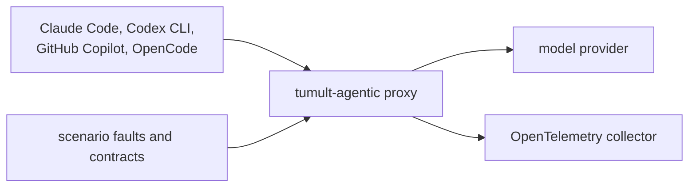
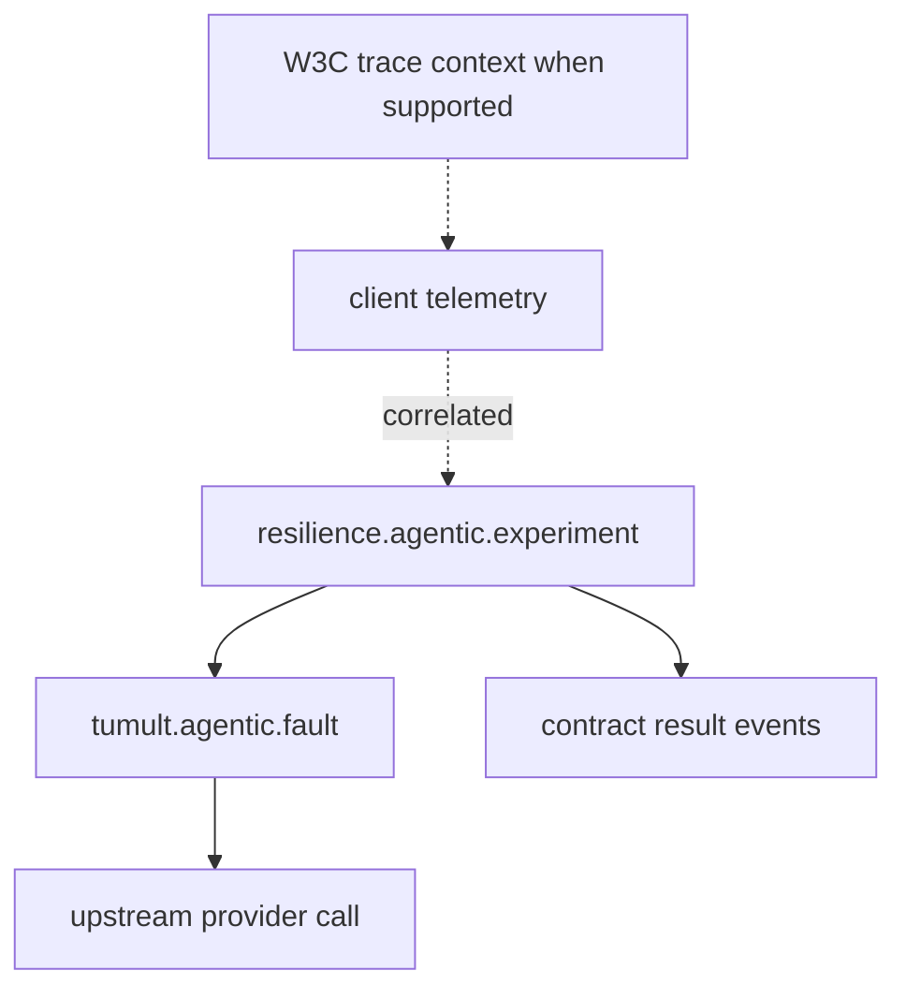
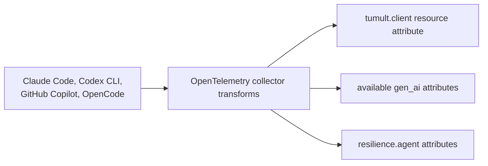

# Chaos-Test Your AI Agent

You wouldn't ship a payments service without breaking it on purpose first. So why are we all wiring AI agents straight into our toolchains and *hoping* they behave when the model is slow, the tool times out, or the retrieved context is quietly wrong?

`tumult-agentic` treats your coding agent as a **system under test**. Same chaos-engineering muscle you already use on infrastructure; latency, errors, partial failures; pointed at the thing that's now writing your code, calling your tools, and reading your data.

It works with the agents people actually run: **Claude Code, the Codex CLI, GitHub Copilot, and OpenCode.**



## The trick: a fault-injecting proxy

Every one of these clients lets you point it at a custom base URL (or an HTTP proxy). That configurable endpoint provides the injection point. `tumult agentic proxy` stands up a local reverse proxy in front of the real provider, and injects a scenario pack's faults into the live traffic:

```bash
# one terminal: faults in front of Anthropic
tumult agentic proxy --upstream https://api.anthropic.com --scenario malformed-json-recovery

# another terminal: just point Claude Code at it and work normally
ANTHROPIC_BASE_URL=http://127.0.0.1:8080 claude
```

Codex? `OPENAI_BASE_URL`. Copilot? `HTTPS_PROXY`. Same proxy, same faults, every client.

The fault catalog is the stuff that actually goes wrong with agents in production:

- **model latency / timeouts**; does it back off, or hang your pipeline?
- **rate limits & provider errors**; synthetic `429`/`5xx`, no upstream call
- **malformed or truncated output**; the JSON you were parsing is now `{garbage`
- **tool failures & tool latency**; the MCP tool it depends on just died
- **retrieval poisoning**; the context it answered from was contaminated
- token-budget, retry-loop, hallucinated-tool-call and context-truncation pressure

And it's not just "throw faults." Each scenario pack ships **behavioral contracts**; `valid_json`, `retry_budget`, `max_tool_calls`, `graceful_error`, `required_citation`, `no_secret_leakage`, and friends; so a run produces a pass/fail resilience verdict, not just vibes.

Want to try it without touching a provider at all? The whole thing runs offline:

```bash
tumult agentic list-packs
tumult agentic run --scenario retrieval-poisoning
tumult agentic replay --fixture examples/agentic/malformed-json-recovery.fixture.json
```

## See the agent flinch; in one trace

The observability path covers both sides of the interaction. Injecting a fault is only half the story; you want to *watch how the agent reacts*. tumult is built on OpenTelemetry, so a run is observed from **both sides**:

- the **experiment side**; a `resilience.agentic.experiment` span tree with fault decisions, contract outcomes, and the resilience score;
- the **target side**; the agent's own spans (Claude Code emits beautiful `gen_ai.*` telemetry), nested under tumult's trace via W3C `traceparent`.



So a latency fault shows up as a spike in the agent's `ttft_ms`. A rate-limit fault shows the `attempt` counter climbing and the retries appearing. Cause and effect, side by side, in one waterfall.

## Four agents, one schema

If you've ever tried to build a dashboard across multiple AI tools, you know the pain: every client emits telemetry in a slightly different dialect. Claude Code does proper spans with `gen_ai.*`. Codex does metrics and log events, no spans. OpenCode goes through a plugin. Copilot through an SDK.

tumult normalizes all of it onto **one canonical schema**; OpenTelemetry GenAI conventions (`gen_ai.*`) plus tumult's `resilience.agent.*`, tagged with a `tumult.client` resource attribute; so you build your contracts and dashboards once and they work for all four.



A drop-in OTel Collector config does the lifting (`collector/otel-agentic-normalization.yaml`, and it's already wired into the docker lab). The guaranteed-uniform floor is the proxy span; even for a client that can't propagate trace context, you still get an identical, client-tagged span.

## tumult as the driver

Want the full loop hands-off? `tumult agentic run-live` makes **tumult the trace root**: it starts the experiment span, runs `claude -p` with the trace context + telemetry + the proxy base URL all wired up, and evaluates the pack's contracts against the agent's answer.

```bash
tumult agentic run-live --prompt "summarize the repo" \
  --scenario tool-timeout-fallback --base-url http://127.0.0.1:8080
```

Under the hood the agent call sits behind a small `AgentRunner` trait; which is mostly an implementation detail, except it means the orchestration logic is fully unit-tested without needing a live model. (We're chaos engineers; we test the thing that tests the thing.)

## Who this is for

- **Chaos engineers**; your existing discipline, now aimed at the AI layer. Same hypotheses, same blast-radius thinking, new system under test.
- **SREs**; real OTel traces and metrics, an EU-friendly metadata-only default, and contracts you can alert on. Observability that treats the agent like any other dependency.
- **AI engineers**; find out how your agent *actually* behaves under retrieval poisoning, hallucination pressure, and a flaky tool; before your users do.
- **Developers**; you handed an agent the keys to your repo. This is how you take the wheel back: point it at the proxy, break things on purpose, and see what holds.

It's Rust, it's local, it needs no API keys to get started, and it speaks OpenTelemetry to whatever backend you already run.

```bash
tumult agentic smoke      # deterministic, offline, 10 seconds
```

Go break your agent. On purpose. While it's still cheap.

— see the [Agentic Quickstart](../guides/agentic-quickstart.md), [Live Clients](../guides/agentic-live-clients.md), and [Cross-Client Observability](../guides/agentic-cross-client-observability.md) guides to dig in.
