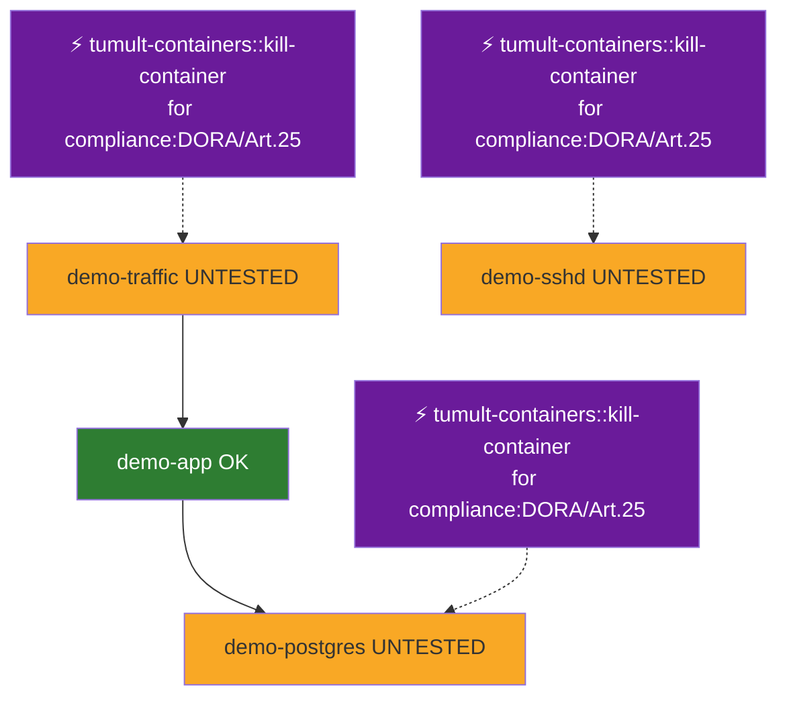
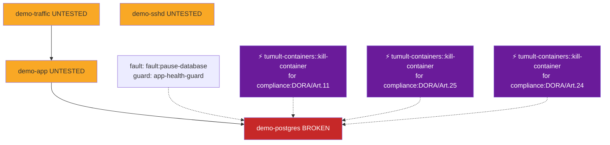
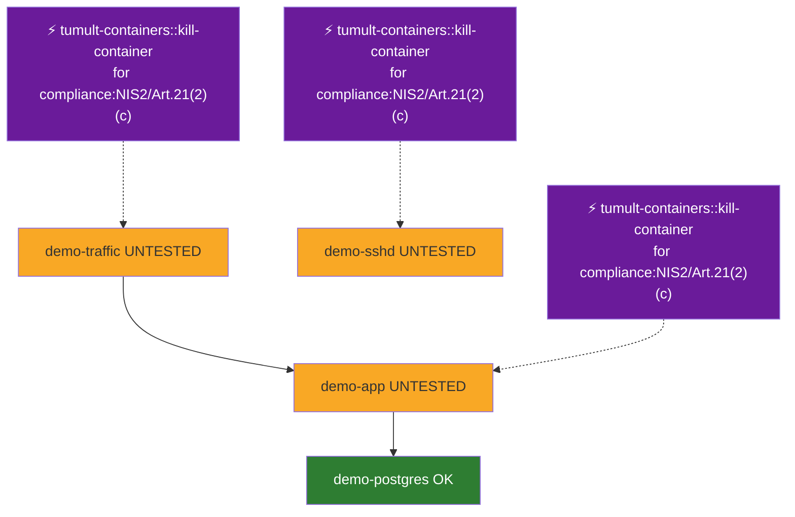

# Where Compliance Breaks: Lineage on the Service Map

*2026-07-06*

A compliance report that says "NON-COMPLIANT" is a smoke alarm; loud, and no help finding the fire. What an operator actually wants to see is a map: *this* service, *this* control, broken by *that* fault injection, and *here* is the next experiment that would improve the score.

This release makes ChaosGraph draw exactly that map. Three pieces landed together: a declared service topology, compliance lineage that pins evidence and breaks onto it, and a deterministic recommender that marks where to inject next. Everything below is real output from the demo stack; one `make demo`, three proof runs, no mockups.

## 1. Declare the topology

ChaosGraph always knew *which* services experiments touched; it never knew how they related. Now you declare it, in reviewable TOML, because a map you can audit beats a map something guessed:

```toml
[[service]]
name = "demo-traffic"
depends_on = ["demo-app"]
tier = "edge"

[[service]]
name = "demo-app"
depends_on = ["demo-postgres"]
tier = "service"

[[service]]
name = "demo-postgres"
tier = "data"
```

`tumult topology import` writes it into the graph as `depends_on` edges. Run-derived service nodes join the declared ones by name; the map and the run history become one graph.

## 2. Green lineage: evidence lands on the map

Proof run 1 is the demo latency drill, now carrying a DORA Art. 25 mapping. It completes, the run produces an `evidences` edge, and the control-scoped map (`--framework DORA --control Art.25`) turns demo-app green:




## 3. A break, with the cause attached

Proof run 2 is the guard-halt demo: pause `demo-postgres`, let the safety guard watching `demo-app` health trip, halt, roll back. The run maps DORA Art. 11 but completes as `Halted`; so no evidence is produced, and the deviation now carries the guard name, the observed value, and a `caused_by` edge to the fault. Attribution is conservative: a failed action attributes to its fault, a guard halt with exactly one injected fault attributes to that fault, anything ambiguous stays honestly unattributed.




The lineage answer for "why is Art. 11 broken on demo-postgres?" is one CLI call; or one MCP call for your agent; and it names the fault, the guard, and the run:

```
$ tumult topology lineage --framework DORA
{
  "article_id": "compliance:DORA/Art.11",
  "service_id": "svc:demo-postgres",
  "status": "broken",
  "evidence_strength": null,
  "cause": {
    "deviation_id": "dev:11dca8bd-2416-4d8b-a2ae-8b6d75320857",
    "fault_id": "fault:pause-database",
    "guard_name": "app-health-guard",
    "failing_actions": [],
    "run_id": "11dca8bd-2416-4d8b-a2ae-8b6d75320857"
  },
  "experiments": [
    "exp:Demo \u2014 auto-halt guardrail pulls the plug when demo-app goes unhealthy"
  ]
}
```


## 4. Close the loop: the recommender marks the next injection

Proof run 3 asks the recommender where to inject next. The scoring is deliberately boring; compliance state × citation strength × how many services depend on this one × proximity to known breaks × a bonus for never-tested actions; every factor recorded as a human-readable reason, no model in the loop, same store in, same ranking out:

```
$ tumult topology recommend --limit 6
{
  "service_id": "svc:demo-postgres",
  "plugin": "tumult-containers",
  "action": "kill-container",
  "article_id": "compliance:DORA/Art.11",
  "strength": "direct",
  "score": 2.5,
  "reasons": [
    "compliance:DORA/Art.11 is broken on svc:demo-postgres",
    "citation strength for compliance:DORA/Art.11 is direct",
    "1 service depend on svc:demo-postgres",
    "svc:demo-postgres itself has a broken control",
    "action tumult-containers::kill-container never tested"
  ]
}
```

(the full list also flags the untested NIS2 Art. 21(2)(c) BC/DR gap on the same data tier; the gap proof run 3 closes)


Run the recommended experiment and re-render the map scoped to that control; demo-postgres turns green for NIS2 Art. 21(2)(c). Note what does *not* happen: on the DORA view, Art. 11 on demo-postgres stays red, because lineage is worst-of and the only thing that clears a broken control is the breaking experiment itself passing. No evidence-washing by running an easier test:




The gap closes, and the whole journey; declared topology, the break, the cause, the recommendation, the improvement; is durable graph history you can query later, including from an agent via the new `tumult_topology_*` MCP tools or arbitrary openCypher through `tumult_chaosgraph_cypher`.

## Why this shape

Three design decisions worth naming:

- **Declared topology, not discovered.** Discovery (k8s, traces) can come later as *input* to the same TOML; the graph itself only ever holds reviewed facts.
- **No guessing in attribution.** A wrong "root cause" in a compliance record is worse than none. Ambiguity renders as "unattributed" on the map, and that's a feature.
- **The recommender is explainable arithmetic.** Auditors ask "why this recommendation?"; the answer is five multiplication factors with reasons, not a temperature.

`make demo-topology` reproduces all three proofs; captures live in `demo/proof/topology/`. The topology guide has the full CLI/MCP reference.
