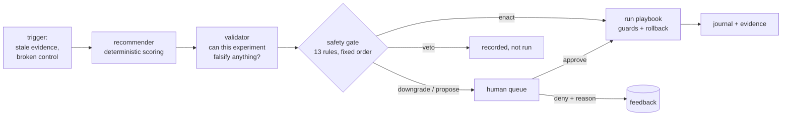
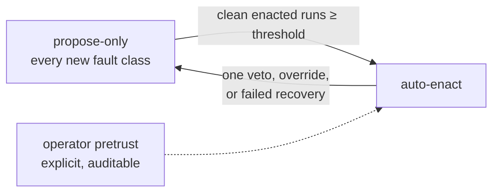
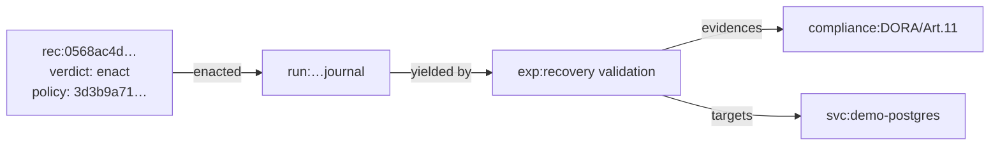
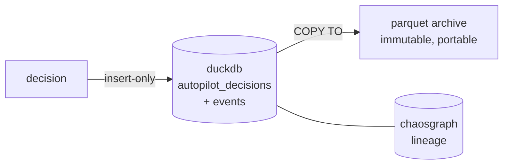

# autopilot: chaos engineering that decides — and shows its work

*2026-07-07*

every chaos platform can run an experiment. a few can recommend one. nobody ships the part in between — the thing that looks at your compliance posture, picks the next experiment, decides *on its own* whether it's safe to run right now, runs it, and leaves a paper trail a regulator could follow.

that's what tumult 2.15 does. and before you close the tab at "decides on its own": the whole design is about making autonomy *boring*. deterministic. reproducible. veto-able. audited before anything fires.

## the one rule

the recommender proposes. the gate disposes. nothing else gets to touch your systems.



no model in the loop. the recommender is arithmetic — compliance state × citation strength × how many services depend on this one × proximity to known breaks × novelty — and every factor writes a human-readable reason. the gate is thirteen rules evaluated in a fixed order, every one recorded with its outcome. same store, same policy file, same verdict, every time. the policy file's sha256 is stamped on every decision, so "why did this run?" has a reproducible answer years later.

## what the gate actually said

this is real output from the demo stack — one `make demo`, nothing mocked. the recommender found the broken DORA Art. 11 control on demo-postgres and three more candidates. watch what the gate did with them:

```
autopilot pass: 4 decision(s), 1 enacted (policy 3d3b9a71…)
[enact] svc:demo-postgres tumult-containers::kill-container for compliance:DORA/Art.11 (score 2.50)
        ran demo/experiments/demo-topo-recommended.toon -> completed
[veto]  svc:demo-postgres … for compliance:Basel-III/OpResPrinciple4 — ambient.no_open_deviation
[veto]  svc:demo-postgres … for compliance:DORA/Art.25 — ambient.no_open_deviation
[veto]  svc:demo-postgres … for compliance:ISO-22301/Clause8.5 — ambient.no_open_deviation
```

one enact, three vetoes. the enacted one was the *revalidation of the break itself* — a class the operator explicitly pretrusted. the three vetoes are the part i'm proudest of: demo-postgres had an open break, and the only injection the gate allows into a broken service is the one that revalidates the break. everything else gets `ambient.no_open_deviation` — never kick a system that's already down. nobody configured that per-experiment; it's a gate rule.

run the same pass again a few minutes later:

```
[downgrade] svc:demo-postgres tumult-containers::kill-container for compliance:DORA/Art.11
            (score 2.50) — cooldown active: 0.0h since the last autopilot run
            on svc:demo-postgres, policy requires 12h
```

same candidate, but the per-service cooldown is now active — so instead of running, it lands in the human queue with the exact rule that stopped it. a human denies it with a reason, and that denial is recorded as feedback. deny enough of a fault class and it loses its autonomy.

## earned autonomy, not configured autonomy



a fault class doesn't get to run itself because someone set a flag six months ago. it starts propose-only, earns enactment rights through a track record of clean runs (the ratio and minimum sample count are policy), and loses them the moment a human vetoes or a run fails to recover. the only shortcut is an explicit `[[autopilot.pretrusted]]` block — visible in the policy file, hashed into every decision.

## every decision is a graph citizen

decisions aren't log lines. they're nodes in ChaosGraph, linked to the run they enacted, which links to the evidence it produced, which links to the regulatory article it satisfies:



so `why did latency get injected into demo-postgres at 03:14?` is one graph query — or one openCypher query via `tumult_chaosgraph_cypher`, since agents get the same lineage humans do. vetoed and downgraded decisions are in there too. the decisions that *didn't* run are as auditable as the ones that did.

## storage: hot analytics, cold evidence



decisions and their lifecycle events (run started, completed, human approved/denied) are two insert-only tables in the same DuckDB store as your journals and graph — no update or delete surface exists in the code, and the decision row is written *before* the experiment fires. a crash between decision and run leaves the truthful partial record. `tumult autopilot export` copies the tables to parquet: an immutable archive any tool your auditor brings can read.

## proved, not promised

the release gate for 2.15.0 was three consecutive clean runs of the full demo proof suite — twelve asserted proofs each: the green lineage, the guard-halt break with cause attribution, the recommendation loop closing a NIS2 gap, and the whole autopilot story above (enact, ambient vetoes, cooldown downgrade, human denial, graph lineage, parquet archive). `make demo-topology` reproduces all of it on your machine; the captures live in `demo/proof/topology/`.

## try it

```
tumult autopilot once --policy autopilot.toml            # decide + record, inject nothing
tumult autopilot once --policy autopilot.toml --execute  # the real thing, gate willing
tumult autopilot status                                   # the queue + history
tumult autopilot deny <id> --reason "not this quarter"    # your veto is feedback
```

the [autopilot guide](../guides/autopilot.md) has the policy reference. start with `--execute` off and read what the gate *would* have done — that's the whole point: you can read its mind before you hand it the keys.
