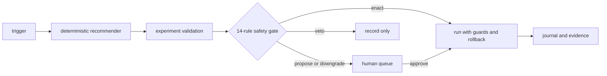

# Autopilot: Decisions With an Audit Trail

*Originally published 2026-07-07; verified against Tumult 2.16.1 on 2026-07-21.*

Tumult 2.15 introduced an autopilot workflow that turns recommendations into
recorded decisions. It can propose an experiment, evaluate it against a safety
policy, and either enqueue, veto, downgrade, or execute it. Execution remains
opt-in through `--execute`.

The design is deterministic. The recommender scores known repository and
compliance state; it does not call a language model. The gate evaluates 14
rules in a fixed order and records each outcome. A hash of the policy is stored
with the decision so an operator can reproduce which policy was applied.



## Gate behavior

The demo proof exercises several outcomes in one pass. This excerpt is kept as
an example of the command's output shape; identifiers and scores depend on the
store and policy used for a run.

```text
autopilot pass: 4 decision(s), 1 enacted
[enact] svc:demo-postgres tumult-containers::kill-container for compliance:DORA/Art.11
[veto]  svc:demo-postgres ...; ambient.no_open_deviation
[veto]  svc:demo-postgres ...; ambient.no_open_deviation
[veto]  svc:demo-postgres ...; ambient.no_open_deviation
```

The ambient-deviation rule prevents unrelated injections into a service that
already has an open deviation. A later pass can downgrade the same candidate
when the per-service cooldown is active. These decisions are recorded even
when no experiment runs.

## Earned autonomy

New fault classes begin in propose-only mode. A class can become eligible for
automatic enactment after the policy's minimum number and ratio of clean runs.
A veto, override, or failed recovery returns it to propose-only mode. Operators
can also declare an explicit pretrusted class in the policy; that choice is
visible in the policy and therefore in its recorded hash.

## Lineage and storage

Autopilot decisions are represented in ChaosGraph and linked to an enacted run,
the evidence it produced, its target service, and any compliance control it
supports. Vetoed and downgraded decisions are retained as well.

Decision and lifecycle-event rows are inserted into DuckDB before execution.
They can be exported to Parquet with `tumult autopilot export`. This provides a
portable record, but immutability still depends on how the operator protects
the database and exported files; Tumult does not by itself provide a WORM
storage guarantee.

## Additions in Tumult 2.16

Tumult 2.16 added four inputs to the decision process:

- a pre-flight probe checks that guard telemetry is observable before enactment;
- targets must be explicitly enrolled;
- recorded change events can invalidate evidence and trigger revalidation;
- observed OpenTelemetry span rates can contribute to service criticality.

Kubernetes discovery can produce a proposed topology file. It intentionally
leaves dependencies for review because Kubernetes service metadata does not
establish application-level dependency direction.

## Reproduce it

```bash
# Decide and record without injecting a fault.
tumult autopilot once --policy autopilot.toml

# Permit execution when the gate returns enact.
tumult autopilot once --policy autopilot.toml --execute

tumult autopilot status
tumult autopilot deny <id> --reason "not this quarter"
```

The [autopilot guide](../guides/autopilot.md) documents the policy schema and
gate behavior. The repository demo exercises the integrated workflow with
`make demo-topology`; its environment requirements are documented alongside
the demo rather than treated as proof for every deployment target.
