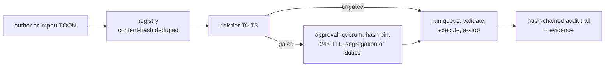

# Get Started with the Tumult Web UI

*Published 2026-08-05; verified against Tumult 2.20.0.*

The `tumult` CLI is the engine that executes experiments. The `tumultd`
daemon and its embedded web UI are the governance half of the platform: the
place where experiments are registered, approved, executed under guardrails,
stored, and reported. This post walks the path from `docker compose up` to a
fully audited run, using only what the code actually does.

## Start the platform

The platform path is one compose file,
`docker/docker-compose.kronika.yml`. It refuses to start without three
secrets, so copy the template first:

```bash
cp .env.example .env   # fill in the three KRONIKA_* values
docker compose -f docker/docker-compose.kronika.yml up -d --build
# open http://localhost:14318/
```

The three required values, all enforced with `:?required` in the compose
file:

- `KRONIKA_BOOTSTRAP_ADMIN_PASSWORD` — bootstrap password for the demo admin
  (first boot only);
- `KRONIKA_BOOTSTRAP_TOKEN` — a `kro_`-prefixed API token provisioned for the
  seed/demo CLI on first boot;
- `KRONIKA_INGEST_TOKEN` — the bearer token required on the OTLP ingest
  endpoints (`/v1/*` HTTP and gRPC).

The guard is fail-closed on purpose: the daemon binds `0.0.0.0` in the
container, and a non-loopback bind without an ingest token, or without any
user, refuses to start (ADR-012). Host ports are `14317`/`14318` so the demo
coexists with a collector that already owns the standard `4317`/`4318`.

The stack builds the UI and the `tumultd` binary in Docker, then a `seed`
service runs a real eight-experiment suite over OTLP and registers three
manual-evidence records in different lifecycle states — so the first login
already shows data.

Prefer a local build? Build the UI first, then the daemon — the binary
embeds `web/build/`:

```bash
cd web && npm ci && npm run build && cd ..
cargo build --release -p tumultd
./target/release/tumultd create-admin            # one-time password, printed once
./target/release/tumultd                         # serve on :4317/:4318
```

`tumultd create-admin` opens the store directly, so run it before the
daemon holds the write lock. Unlike the compose bootstrap, this path forces
a password change on first login. On a loopback-only bind with zero users
the daemon starts unauthenticated (dev mode, with a warning) — that is
deliberate, and only possible on loopback.

## Log in: sessions, tokens, roles

Sessions are 256-bit opaque cookies (`HttpOnly`, `SameSite=Strict`, 12h);
automation uses revocable `kro_`-prefixed API tokens instead. Authorization
is a single route table with `viewer < operator < approver < admin` roles
and optional per-environment scopes — unmatched routes fail closed. The
distinction that matters day to day: a **viewer** can browse everything,
including the authoring catalog and scaffolding endpoints, but registering,
running, stopping, and scheduling are **operator**-level, approvals need an
**approver**, and user plus webhook administration is **admin**-only.

## The governance loop

The core flow is registry → approval → run → audit:



- **Registry** — `POST /api/runs/validate` puts a definition through the
  exact parse/resolve/validate pipeline the CLI uses and content-hash-dedupes
  it into the registry. Identical definitions registered twice collapse to
  one entry.
- **Dry-run** — the New Run page (`/runs/new`) resolves `${var}` parameters
  and dry-runs the *exact resolved plan* — hypothesis, method steps,
  rollbacks, plus a blast-radius `plan.scope` block — before anything
  executes.
- **Approval gate** — the definition's frozen facts classify the run into a
  risk tier (T0–T3). Gated runs park in `pending_approval` behind a quorum
  of approvers, a SHA-256 pin over the resolution inputs, a 24h TTL, and
  single-use consumption at dispatch. The requester can never approve their
  own run; a break-glass override exists and leaves evidence (ADR-013).
- **Execution** — approved runs dispatch onto the daemon's bounded worker
  pool (`TUMULTD_RUN_CONCURRENCY` / `TUMULTD_RUN_QUEUE_DEPTH`). The run
  detail page shows the live telemetry waterfall, the consumed approval
  chain, and the per-run hash-chained audit trail.
- **E-stop** — every run has a two-step stop (`POST /api/runs/{id}/stop`):
  the first click arms, the confirm halts the run before the next activity
  and unwinds rollbacks. The Runs page also carries a two-click **stop-all**
  kill switch (`POST /api/runs/stop-all`) — deliberately never a bare
  one-click action.
- **Evidence** — the Events page (`/api/events`) is the cross-run audit feed
  over the hash-chained `run_audit` table, newest first, with the chain links
  visible; per-run chain verification lives on
  `/api/runs/{id}/audit/verify`.

## Author without leaving the browser

The `/author` page is a browsable fault catalog — domains → actions/probes
with their documented arguments — served live from plugin discovery
(`GET /api/authoring/catalog`, reading `./plugins`, `~/.tumult/plugins`, and
`TUMULT_PLUGIN_PATH`). Picking an action deep-links into the wizard at
`/author/new`: a parameter form generated from the action's documented
arguments, one-click TOON scaffolding (`POST /api/authoring/scaffold`), an
editable TOON editor, and a "Validate & register" step that hands off into
the New Run launcher (`/runs/new?registry_id=…`). Both authoring endpoints
are Viewer-level and persist nothing — registration stays behind the
Operator-gated validate endpoint. These are the same code paths as the MCP
`tumult_fault_catalog` / `tumult_scaffold_experiment` tools, with no MCP hop.

## The rest of the surface

- **Schedules** (`/schedules`) — interval schedules over registered
  definitions: `POST /api/schedules` validates that the definition resolves
  with the supplied variables (a bad schedule fails fast with 400 instead of
  erroring every tick), with intervals between 60 seconds and 30 days, and
  enable/disable/delete endpoints.
- **GameDays** (`/gamedays`) — campaign registration mirrors run
  registration: every referenced experiment is validated and registered, then
  the campaign itself is registered with `kind = 'gameday'`.
- **Webhooks** (`/webhooks`, admin-only) — outbound event sinks; the HMAC
  secret is returned exactly once at creation and never appears in list
  rows.
- **Users** (`/users`, admin-only) — create users (generated one-time
  password shown once), change roles, edit environment scopes, reset
  passwords, disable accounts, and mint or revoke API tokens.
- **Manual evidence** (`/manual`) — records for what telemetry can't see
  (game days, tabletops, vendor failovers) move draft → submitted → verified
  with reviewer ≠ enterer, each transition appended to the hash-chained
  audit trail.
- **Reports** (`/reports`) — R1 executive digests, R2 evidence packs
  (DORA/NIS2/ISO 27001/SOC 2, including the approval-chain
  change-management section), and R3 game-day reports, rendered as
  document-controlled PDFs from the same store.

## Where next

The [platform walkthrough](../guides/platform-walkthrough.md) is the full
click path — login → register → approve → run → e-stop → evidence pack —
with screenshots from the seeded demo stack. The
[analytics architecture](../architecture/kronika-architecture.md) documents
the single-writer lake, run queue, approval pinning, and report pipeline
behind these screens, and [production deployment](../guides/production-deployment.md)
covers binaries, containers, and hardening. The next post covers the
ingest-and-analytics side: [Get started with Krönika](27-kronika-getting-started.md).
