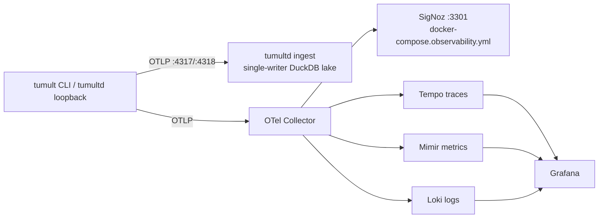

# Get Started with Krönika: The Tumult Analytics Pipeline

*Published 2026-08-05; verified against Tumult 2.20.0.*

Krönika is the analytics half of Tumult: the `tumultd` ingest daemon, the
unified DuckDB lake behind it, the semantic metrics layer, and the
compliance reports rendered from the same store. Where the CLI answers "did
this experiment pass", Krönika answers "how is our resilience trending, and
where is the evidence". This post traces the pipeline from OTLP bytes on the
wire to a PDF evidence pack.

## OTLP ingest

`tumultd` speaks OTLP natively — no collector required in front of it:

- **OTLP/gRPC** on `KRONIKA_OTLP_GRPC_ADDR` (default `0.0.0.0:4317`) — the
  endpoint tumult's exporter already targets;
- **OTLP/HTTP** protobuf on `KRONIKA_OTLP_HTTP_ADDR` (default
  `0.0.0.0:4318`), serving `/v1/*` plus an open `GET /healthz`.

Both listeners fail closed: if either binds a non-loopback address without
`KRONIKA_INGEST_TOKEN`, the daemon refuses to start rather than accept
unauthenticated telemetry from the network. TLS is optional via
`KRONIKA_TLS_CERT` / `KRONIKA_TLS_KEY` (one PEM pair covers both servers).
On loopback binds the token is optional — that is the local dev mode.

Point the CLI at it and run:

```bash
KRONIKA_OTLP_GRPC_ADDR=127.0.0.1:4317 KRONIKA_OTLP_HTTP_ADDR=127.0.0.1:4318 tumultd &

OTEL_EXPORTER_OTLP_ENDPOINT=http://localhost:4317 \
OTEL_EXPORTER_OTLP_HEADERS="authorization=Bearer $KRONIKA_INGEST_TOKEN" \
  tumult run examples/redis-chaos.toon
```

(The headers line is only needed once an ingest token is set; on the
loopback dev bind above it can be omitted.) Traces, metrics, and logs from
the run land in the store before the experiment finishes. Two more ingest
paths round out the picture: `TUMULT_DAEMON_URL` makes the CLI push each
journal to the daemon's `/api/import/journal` through the same single
writer, and `tumultd import <file>` loads CSV or journal JSON by hand.

## One store, one writer

Everything — telemetry spans, logs, metrics, run state, manual evidence,
auth identities, and the journal-analytics family (experiments, activities,
ChaosGraph, autopilot) — lives in one embedded DuckDB file:
`TUMULT_LAKE_PATH`, defaulting to `~/.tumult/lake.duckdb`.

DuckDB is single-writer per file, so the daemon funnels all writes through
one channel onto one writer; readers open the store with
`access_mode = READ_ONLY` and coexist alongside the writer without taking
the lock. A conflicting second opener gets a clear `StoreLocked` error
instead of an opaque DuckDB message. This is why live reports are served by
the daemon's `GET /report?metric=<name>` endpoint while `tumultd report
--metric <name>` — which opens the store itself — needs the daemon stopped.

## The parquet lake

The lake job exports every table to immutable, day-partitioned parquet on a
schedule:

- `KRONIKA_LAKE_INTERVAL` (default `24h`; `0`/`off` disables) drives the
  incremental, watermark-driven export into `KRONIKA_LAKE_DIR` (default
  `<db dir>/lake`);
- `KRONIKA_RETENTION_DAYS > 0` then deletes already-exported hot rows older
  than that many days — the manual-evidence tables are never deleted;
- `POST /api/lake/export` triggers the same job on demand, and
  `GET /api/lake/status` reports where the watermark sits.

Parquet output is ZSTD-compressed via Arrow. Write-once parquet plus the
hash-chained audit trails form a WORM-shaped evidence trail (ADR-010) —
portable to pandas, Polars, Spark, or a plain `read_parquet()` in any DuckDB
session.

## Semantic metrics

The metrics layer (`tumult-metrics`) compiles YAML metric views from
`KRONIKA_METRICS_DIR` (default `metrics/`) into a single `SELECT`. Every
identifier is strictly validated (`[a-z0-9_.]` only) before interpolation,
which makes SQL injection through a metric definition impossible by
construction. The repository ships nine definitions:

| Metric | Question it answers |
|---|---|
| `hypothesis_pass_rate` | Share of runs that completed without deviation or failure |
| `deviation_rate` | Fraction of runs whose outcome was `deviated` |
| `experiment_count` | Runs in the window, per experiment |
| `experiment_duration_s` | Mean experiment lifecycle duration |
| `experiment_coverage` | Distinct experiments run in the window |
| `coverage` | Distinct target systems under test |
| `action_duration_s` | Mean action duration, per plugin |
| `action_duration_p95` | Tail action latency (currently a placeholder: mean, not p95) |
| `mttr` | Mean time to recovery across runs |

Each definition names a source table, a measure (`count`, `sum`, `avg`,
`count_distinct`, or a `rate` of two filtered terms), dimensions, and
conditions — for example
`hypothesis_pass_rate` is a rate over the `tumult.experiments.total` counter
where `outcome_status = success`. Render one from the live daemon with
`GET /report?metric=<name>`, or set `KRONIKA_REPORT_INTERVAL` (e.g. `1h`) to
have the daemon render a digest per interval into `<db dir>/reports/`,
listed on the UI's Reports page via `/api/reports`.

## Compliance reports

The `tumult-compliance` crate turns the same store into document-controlled
artifacts:

- **R1** — executive resilience digest, with org-hierarchy rollups from the
  scores tree;
- **R2** — the evidence pack (DORA/NIS2/ISO 27001/SOC 2), including the
  approval chain of every gated run in the window as the change-management
  section;
- **R3** — per-run game-day report.

Reports render as embedded-Typst PDFs with print-HTML previews, respect
per-user environment scopes, and record the coverage each artifact was built
from. The CLI path (`tumult compliance --framework dora .`) maps journals to
the same frameworks — DORA, NIS2, PCI-DSS, ISO 27001, SOC 2, ISO 22301,
Basel III — and the [regulatory mapping](../regulatory-mapping.md) documents
the evidence strength of each. These are evidence summaries, not legal or
audit attestations.

## Grafana and SigNoz alongside

`tumultd` is a destination, not a fan-out. When you want Krönika *and* a
general-purpose observability backend, put an OTel Collector in the loop and
tee the telemetry. The repository carries working examples of both shapes:



- **Dev tee** — `docker/docker-compose.kronika-collector.yml` with
  `docker/otel-collector-kronika.yaml`: receives OTLP on host `14317/14318`,
  forwards to `tumultd`, and writes everything to
  `/tmp/otel-dev-export/telemetry.jsonl` for debugging what exporters send.
- **SigNoz** — `docker/docker-compose.observability.yml`: standalone SigNoz
  plus the tumult collector; UI on `http://localhost:3301`, collector health
  on `13133`, Prometheus metrics on `18889`. Collector config:
  `collector/otel-collector-signoz.yaml`.
- **Grafana stack** — `docker/docker-compose.grafana-full.yml` with
  `collector/otel-collector-grafana.yaml`: Tempo (traces), Mimir (metrics
  via Prometheus remote write), Loki (logs), and a pre-wired Grafana. See
  the [Grafana stack guide](../guides/grafana-stack.md) for the OTLP→
  Prometheus metric-name translation table — it matters.

In all cases tumult's own configuration never changes: it speaks OTLP to
one endpoint, and the routing decision lives in the collector.

## Where next

The [observability setup guide](../guides/observability-setup.md) covers the
span hierarchy and attribute reference; the
[analytics architecture](../architecture/kronika-architecture.md) documents
the single-writer lake, lake job, and report pipeline in depth; and the
companion post, [Get started with the Tumult web UI](26-web-ui-getting-started.md),
walks the governance surface this pipeline feeds.
