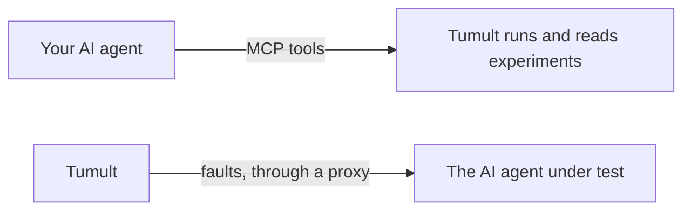

# Work with AI agents

AI agents meet Tumult in two ways. An agent can drive Tumult over MCP, and
Tumult can inject faults into an agent to see how it copes.

```mermaid
flowchart LR
    accTitle: Two ways AI agents meet Tumult
    accDescr: An agent drives Tumult through the MCP server. Tumult tests an agent by injecting faults between the agent and its model.
    a1[Your AI agent] -->|MCP tools| t1[Tumult runs and reads experiments]
    t2[Tumult] -->|faults, through a proxy| a2[The AI agent under test]
```
