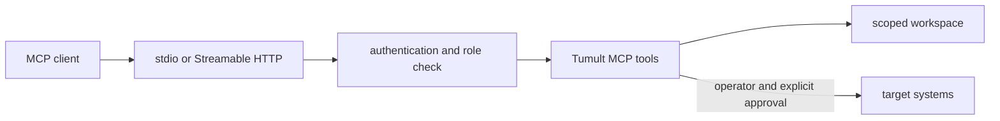

# MCP Guide

Tumult includes a Model Context Protocol server for discovery, authoring,
execution, analytics, compliance, GameDays, ChaosGraph, topology, and autopilot.
The current server exposes 40 tools. The complete inventory is maintained in
the [README](../../README.md#mcp-server) and checked against the Rust schemas in
CI.

## Start the server

```bash
# Local client over stdio.
tumult-mcp

# Streamable HTTP on loopback.
tumult-mcp --transport http --port 3100

# Authenticated HTTP.
TUMULT_MCP_TOKEN='replace-with-a-secret' tumult-mcp --transport http --port 3100
```

Without authentication, HTTP is restricted to loopback. For multiple tokens
and viewer/operator/approver/admin roles, use `TUMULT_MCP_AUTH_CONFIG`. File
arguments are resolved against the configured workspace root; traversal
outside that root is rejected.



## Authentication

Two credential channels are supported:

- **HTTP transport:** send the standard `Authorization: Bearer <token>`
  header. When authentication is configured, requests without the header are
  answered `401` at the HTTP layer before the JSON-RPC payload is read.
- **stdio transport (or explicit override):** pass
  `_meta.authorization: "Bearer <token>"` in the JSON-RPC request params. An
  explicit `_meta` value takes precedence when both channels are present.

Once any token is configured (`TUMULT_MCP_AUTH_CONFIG` or `TUMULT_MCP_TOKEN`),
every request must authenticate — including `tools/list`, `resources/list`,
and `resources/read`. Viewer tokens may call read-only tools; operator,
approver, and admin tokens call everything (the MCP gate has two tiers —
viewer, and operator-or-above). When no token is configured the server runs
open, intended for loopback local development, and the bind guard refuses a
network-exposed HTTP address in that mode.

The HTTP transport rate-limits per client session with a token bucket
(default 20 requests/second sustained, burst 60). Tune or disable it via
environment:

| Variable | Default | Purpose |
|---|---|---|
| `TUMULT_MCP_RATE_LIMIT_RPS` | `20` | Sustained requests per second per client; `0` disables limiting |
| `TUMULT_MCP_RATE_LIMIT_BURST` | `60` | Bucket capacity (maximum burst) |

## Safety contract

Every tool declares MCP annotation hints for read-only, destructive,
idempotent, and open-world behavior. Viewer credentials can use read-only
tools. Writers and fault executors require the operator role. A viewer's
`store_path` argument is ignored — viewers always read the default store.

The destructive tools are four: `tumult_run_experiment`, `tumult_gameday_run`,
`tumult_autopilot_run` (when `execute=true`), and `tumult_autopilot_respond`
(when `approve=true`). MCP clients should require explicit human approval for
them by name, not by annotation alone. An autopilot approval re-evaluates the
full policy gate against current state before the playbook runs, and at most
one fault-injection enactment runs at a time server-wide. Note that even with
`execute=false`, an autopilot pass runs guard probes once against the target
during pre-flight; no faults are injected. Recommendations that invoke a
configured external agent may also make an open-world model request, but
proposed experiment files still pass Tumult's parser and validator before
being written.

## Structured responses

Thirty tools return `structuredContent` and advertise a matching
`outputSchema`. Fixed-value parameters reject unknown values rather than
silently selecting a default. Tool failures use the MCP error result, and
inline text is capped to prevent unbounded responses.

The authoritative response shapes live in
`tumult-mcp/src/handler/output_schema.rs` and are tested against the registered
tool list. Clients should use the advertised schema instead of copying examples
from documentation.

## Run-to-analysis loop

By default, `tumult_run_experiment` persists its journal and ingests it into the
analytics store. Its response reports whether ingestion succeeded, found a
duplicate, was skipped, or failed. An ingestion failure is reported as a
warning and does not change the experiment's execution result.

```text
run experiment -> journal -> analytics store -> coverage/trend/recommendation
```

Use `no_ingest` to disable ingestion or `store_path` to select another store.

## Workspace resources

The server exposes workspace files using `tumult://` resources:

```text
tumult://journal/{file}
tumult://experiment/{file}
tumult://gameday/{file}
```

Only filenames are accepted; path separators and traversal are rejected.
Resource listing uses opaque cursors. List tools use `limit` and `offset`.

## Operational guidance

- Bind authenticated HTTP to a network interface only when remote access is
  required.
- Scope the workspace and target credentials to the smallest useful boundary.
- Let clients auto-approve only operations whose advertised annotations match
  local policy.
- Inspect `tools/list` at connection time so the client follows the installed
  server rather than a documentation snapshot.

See the [CLI reference](cli-reference.md#tumult-mcp),
[agentic recommendations](agentic-recommendations.md), and
[ChaosGraph guide](chaosgraph.md) for workflow-specific examples.

Protocol behavior and terminology follow the official MCP
[transport](https://modelcontextprotocol.io/specification/2025-11-25/basic/transports)
and [authorization](https://modelcontextprotocol.io/specification/2025-11-25/basic/authorization)
specifications.
