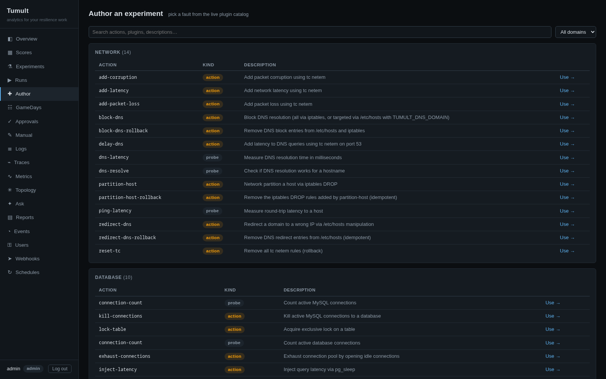
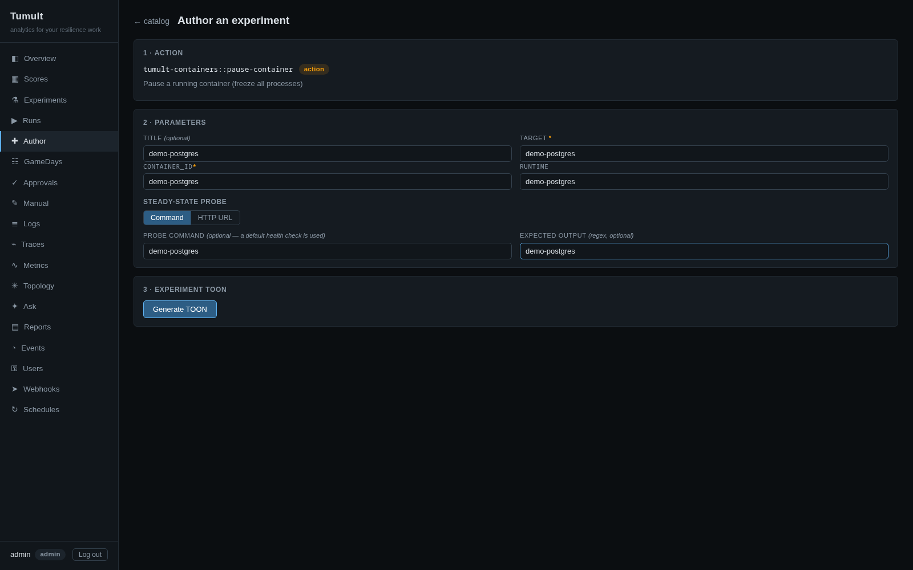
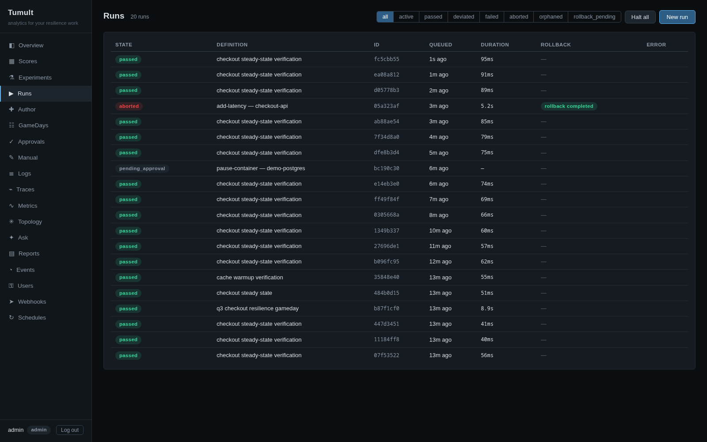
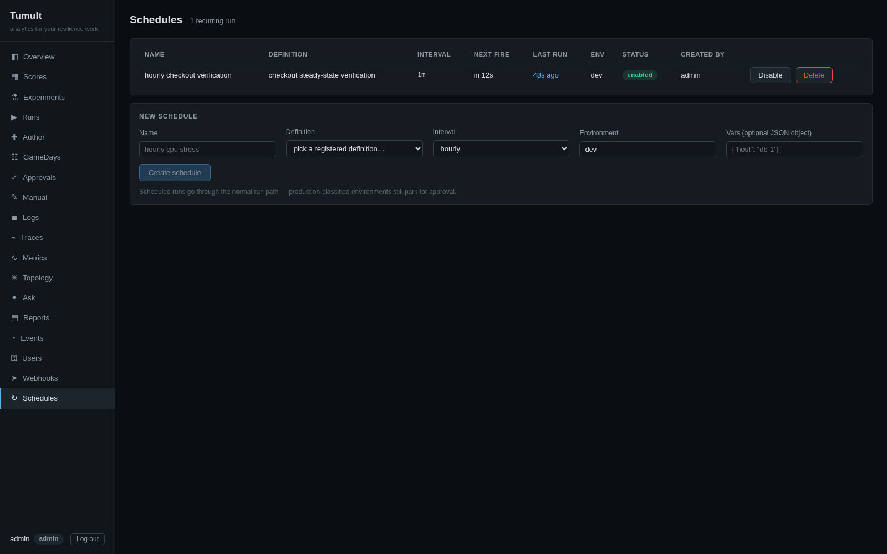
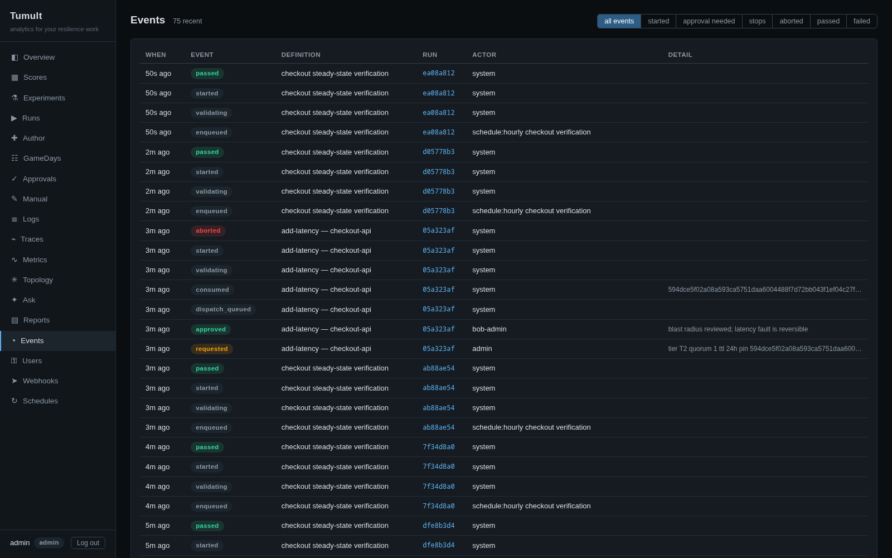
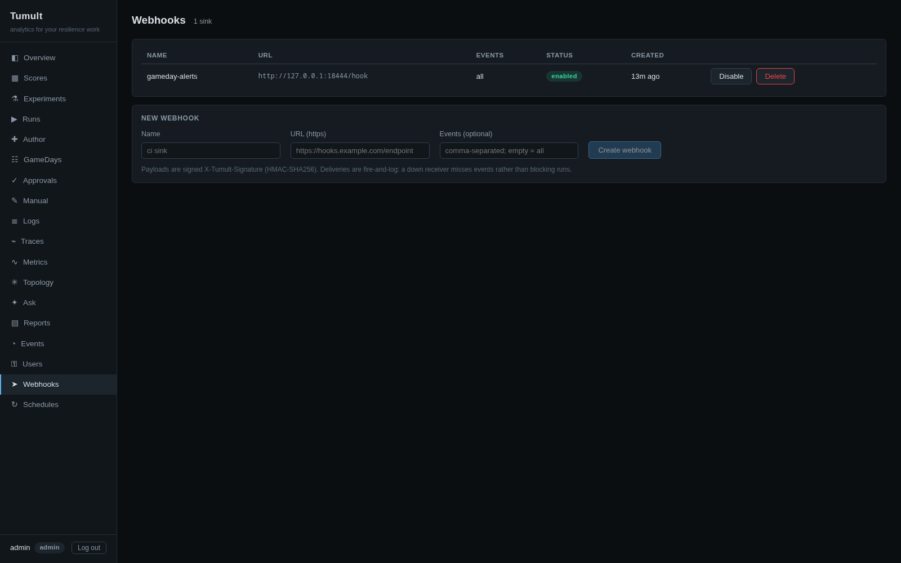
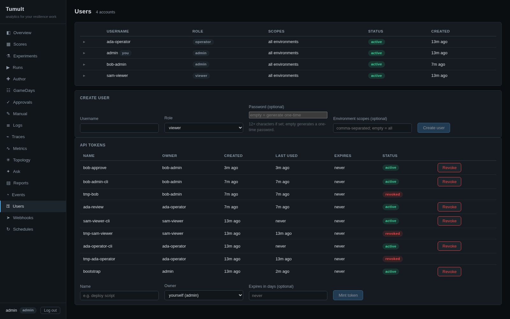
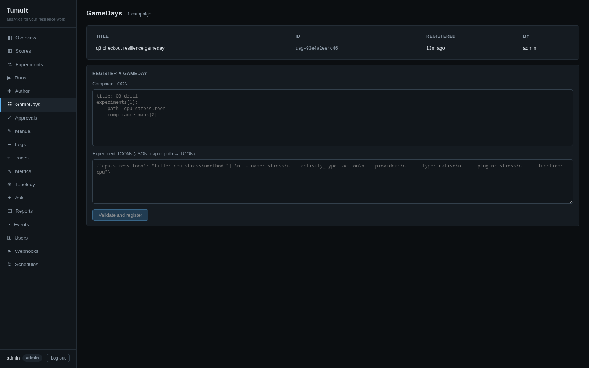

# Platform Walkthrough

A click-through of the Tumult platform: sign in, register an
experiment, run it behind an approval quorum, e-stop a gated run, and
generate the compliance evidence pack. Every screenshot below is the
embedded web UI on the seeded demo stack — nothing is mocked.

## Start the demo stack

```bash
docker compose -f docker/docker-compose.kronika.yml up -d --build
# open http://localhost:14318/ — demo credentials are in the compose file
```

The stack builds the UI and the `tumultd` binary, seeds an eight-experiment
demo suite (run for real over OTLP), three manual-evidence records in
different lifecycle states, and two demo identities: an admin and `bob`, an
approver.

## Sign in


Sessions are 256-bit opaque cookies (`HttpOnly`, `SameSite=Strict`, 12h);
automation uses revocable `kro_`-prefixed tokens instead. Authorization is a
single route table with `viewer < operator < approver < admin` roles —
unmatched routes fail closed.

## The seeded posture

The overview answers "how are we doing" from the store, not from opinion:
hypothesis pass rate, deviation rate, experiments per day, and the fault
breakdown over the selected window.


Scores roll per-experiment results up by org domain to the company root, with
coverage against expected evidence and the weakest member called out. The
treemap drills from company to domain to member.


Every experiment keeps its full trace — hypothesis probes, the fault action,
steady-state checks, and the analytics ingest — as a waterfall built from the
OTLP spans the engine emitted.


Manual evidence covers what telemetry can't: game days, tabletops, vendor
failovers. Records move draft → submitted → verified with reviewer ≠ enterer
(the register below shows a verified record with `bob-admin` as verifier),
each transition appended to a hash-chained audit trail.


## Author from the catalog

The Author page browses the live fault catalog — every action and probe the
mounted plugins expose, grouped by domain — and scaffolds a definition from
any of them without leaving the UI.



Picking an action opens the scaffolding wizard: title, target, the action's
arguments, and an optional steady-state probe, then a generated TOON ready to
validate and register.



The same catalog and scaffolding are available over the API — the same code
paths as the MCP `tumult_fault_catalog` / `tumult_scaffold_experiment`
tools, with no MCP hop:

```bash
curl http://localhost:14318/api/authoring/catalog      # domains → actions → args
curl -X POST http://localhost:14318/api/authoring/scaffold \
  -H 'Content-Type: application/json' \
  -d '{"plugin":"tumult-containers","action":"pause-container",
       "args":{"container_id":"demo-postgres"},"target":"demo-postgres"}'
```

Both endpoints are Viewer-level and persist nothing — the scaffolded TOON
registers through `POST /api/runs/validate` like any other definition.

## Register and run an experiment

Registration happens via the API or the CLI — the definition is validated by
the exact pipeline the CLI uses and content-hash-deduped into the registry:

```bash
curl -X POST http://localhost:14318/api/runs/validate \
  -H "Cookie: kro_session=<session>" -H 'Content-Type: application/json' \
  -d "{\"toon\": $(jq -Rs . < demo/kronika/experiments/config-corruption.toon)}"
```

The Run page then drives the whole loop: pick the registered definition, fill
any `${var}` parameters, dry-run the *exact resolved plan* — hypothesis,
method steps, rollbacks — and start.


## Approval gate

Run creation is change management. The definition's frozen facts classify the
run into a risk tier; this one is T2, so it parks in `pending_approval`
behind a quorum of one approver, with a SHA-256 pin over the resolution
inputs, a 24h TTL, and single-use consumption at dispatch.


Segregation of duties is enforced by the writer: the requester can never
approve their own run. A second identity — `bob-admin` — reviews the
pending request in the queue against its pin and records a decision note.


## The executed run

Once approved, the run dispatches onto the worker pool and its page polls to
terminal. The detail page is the whole story on one screen: the telemetry
waterfall as loopback spans land (here the steady-state probe failed, so the
run aborted and the rollback restored the target), the consumed approval
chain with bob-admin's note, and the per-run hash-chained audit trail from
`requested` through `approved`, `dispatch_queued`, `consumed`, `started`,
`aborted`.


## E-stop a gated run

A second gated run — the pause-container definition parked in
`pending_approval` — is stopped before it ever dispatches. The two-step
e-stop is deliberate: the first click arms, the confirm halts the run before
the next activity and unwinds rollbacks.


The result: state `aborted`, "cancelled before start", `stop_requested`
attributed to the operator in the audit trail, and the approval request
closed out — no approval can resurrect a stopped run. The Runs page also
carries a global two-step **Halt all** for stopping everything active at
once.


## Evidence pack

Finally, the compliance story: R1 executive digests, R2 evidence packs
(DORA/NIS2/ISO 27001/SOC 2), and R3 game-day reports are generated from the
store as document-controlled PDFs. The R2 pack includes the approval chain of
every gated run in the window (SOC 2 CC8.1) — the two runs above,
bob-admin's approval included.

Reports respect the same per-user environment scopes as the rest of Tumult.
A user scoped to specific environments generates digests, evidence packs and
metric reports containing only those environments' data, and each generated
artifact records the coverage it was built from. Scoped users then see only
artifacts whose coverage lies inside their own scopes; global reports and
older artifacts without coverage metadata stay visible to unscoped users
only (a scoped user gets a 404, as with out-of-scope traces). Unscoped
users see and generate everything, exactly as before.


## Operate the platform

The remaining nav pages cover day-to-day operation. The Runs page lists
every run with state filters and the global **Halt all** — the same two-step
arm/confirm as the per-run e-stop, stopping everything active in one shot.



Schedules fire registered definitions on an interval through the normal run
path — production-classified environments still park for approval.



The events feed is the audit spine across runs: every `requested`,
`approved`, `started`, `passed`, `aborted`, and `stop_requested`, newest
first, attributed to the actor (including schedules).



Webhooks push those same events to external sinks, each payload signed
`X-Tumult-Signature` (HMAC-SHA256) with a per-hook secret shown once at
creation.



Users manages accounts and revocable `kro_` API tokens under
`viewer < operator < approver < admin` roles, with optional per-environment
scopes.



GameDays group experiments into scored campaigns — register the campaign
TOON, launch it, and the child runs execute in order under the same approval
tiers.



## Where next

- [Analytics architecture](../architecture/kronika-architecture.md) — the
  single-writer lake, run queue, approval pinning, and report pipeline behind
  these screens.
- [Production deployment](production-deployment.md) — binaries, containers,
  hardening.
- [CLI reference](cli-reference.md) — the same loop from the command line.
