# Platform Walkthrough

A click-through of the merged tumult + Krönika platform: sign in, register an
experiment, run it behind an approval quorum, e-stop a second run mid-method,
and generate the compliance evidence pack. Every screenshot below is the
embedded web UI on the seeded demo stack — nothing is mocked.

## Start the demo stack

```bash
docker compose -f docker/docker-compose.kronika.yml up -d --build
# open http://localhost:14318/ — demo credentials are in the compose file
```

The stack builds the UI and the `tumultd` binary, seeds an eight-experiment
demo suite (run for real over OTLP), three manual-evidence records in
different lifecycle states, and two demo identities: an admin and `bob`, an
approver.

## Sign in

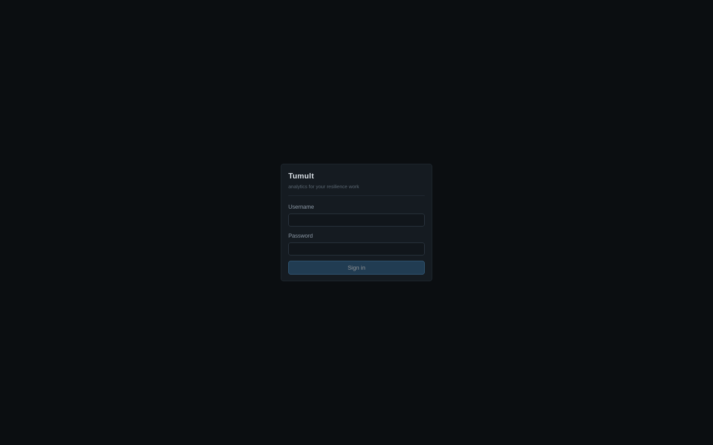

Sessions are 256-bit opaque cookies (`HttpOnly`, `SameSite=Strict`, 12h);
automation uses revocable `kro_`-prefixed tokens instead. Authorization is a
single route table with `viewer < operator < approver < admin` roles —
unmatched routes fail closed.

## The seeded posture

The overview answers "how are we doing" from the store, not from opinion:
hypothesis pass rate, deviation rate, experiments per day, and the fault
breakdown over the selected window.

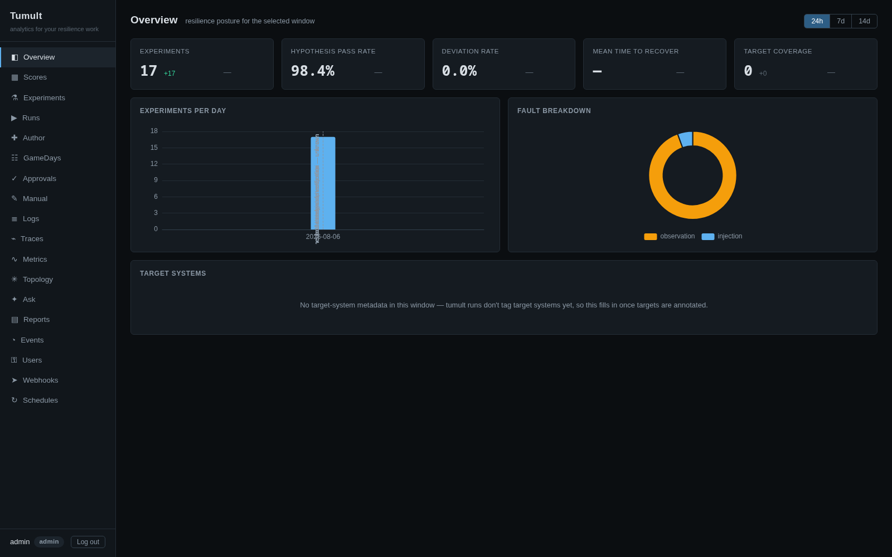

Scores roll per-experiment results up by org domain to the company root, with
coverage against expected evidence and the weakest member called out. The
treemap drills from company to domain to member.

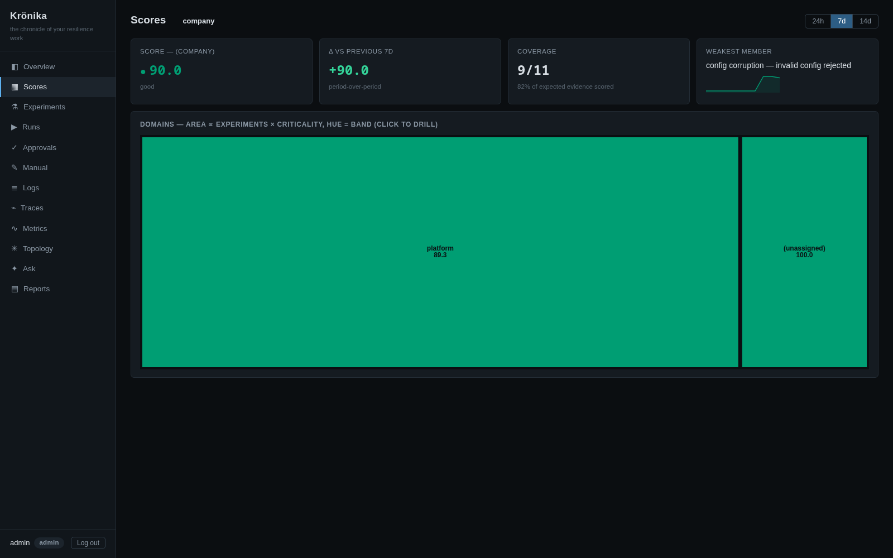

Every experiment keeps its full trace — hypothesis probes, the fault action,
steady-state checks, and the analytics ingest — as a waterfall built from the
OTLP spans the engine emitted.

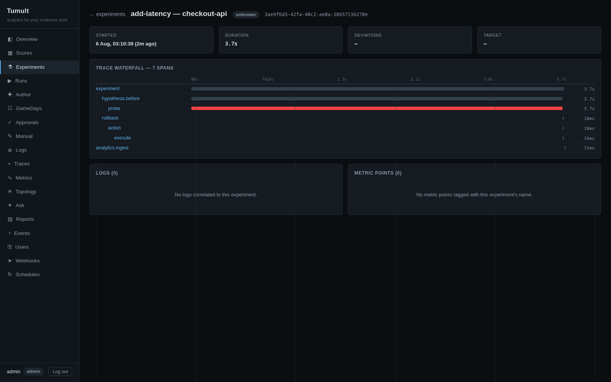

Manual evidence covers what telemetry can't: game days, tabletops, vendor
failovers. Records move draft → submitted → verified with reviewer ≠ enterer
(the register below shows one record in each state; the verified one names
`bob` as verifier), each transition appended to a hash-chained audit trail.

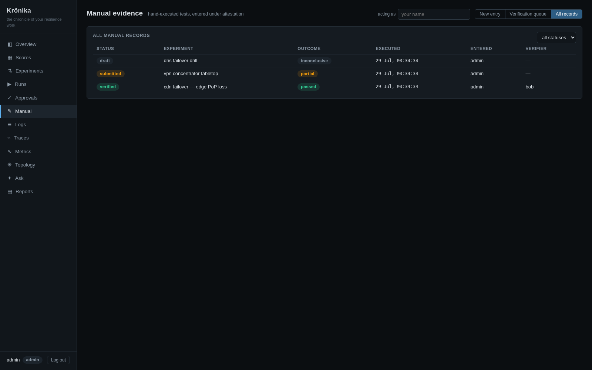

## Register and run an experiment

Registration happens via the API or the CLI — the definition is validated by
the exact pipeline the CLI uses and content-hash-deduped into the registry:

```bash
curl -X POST http://localhost:14318/api/runs/validate \
  -H "Cookie: kro_session=<session>" -H 'Content-Type: application/json' \
  -d "{\"toon\": $(jq -Rs . < demo/kronika/experiments/config-corruption.toon)}"
```

The Run page then drives the whole loop: pick the registered definition, fill
any `${var}` parameters, dry-run the *exact resolved plan* — hypothesis,
method steps, rollbacks — and start.

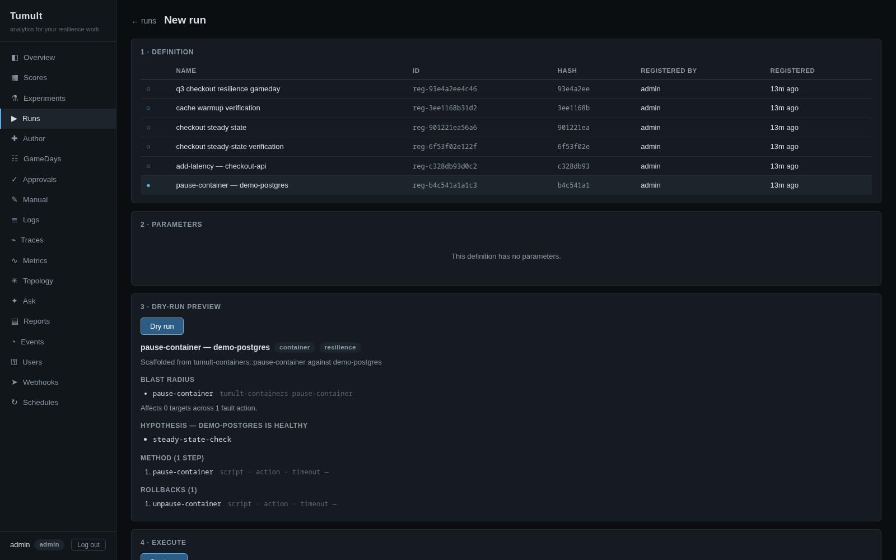

## Approval gate

Run creation is change management. The definition's frozen facts classify the
run into a risk tier; this one is T2, so it parks in `pending_approval`
behind a quorum of one approver, with a SHA-256 pin over the resolution
inputs, a 24h TTL, and single-use consumption at dispatch.

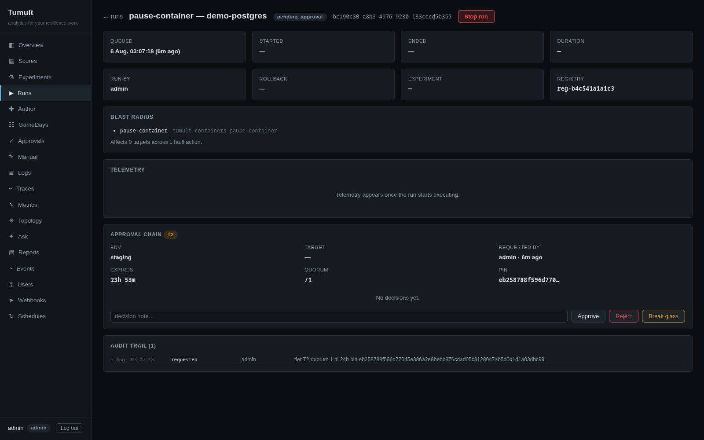

Segregation of duties is enforced by the writer: the requester can never
approve their own run. A second identity — `bob`, an approver — reviews the
pending request in the queue against its pin and records a decision note.

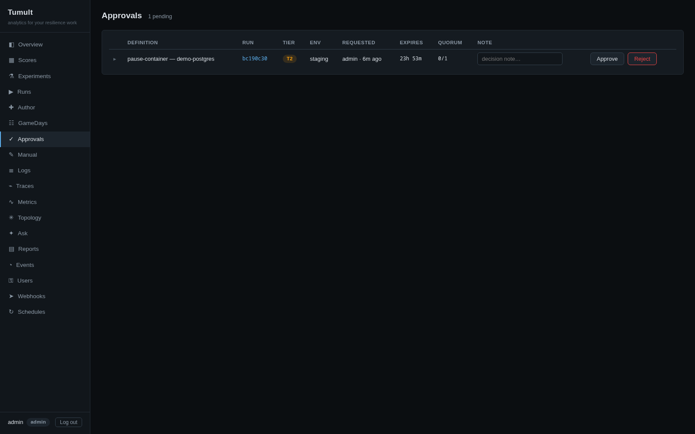

## The executed run

Once approved, the run dispatches onto the worker pool and its page polls to
terminal. The detail page is the whole story on one screen: the telemetry
waterfall as loopback spans land (this definition is designed to deviate —
the rollback restores the known-good config), the consumed approval chain
with bob's note, and the per-run hash-chained audit trail from `requested`
through `approved`, `dispatch_queued`, `started`, `deviated`.

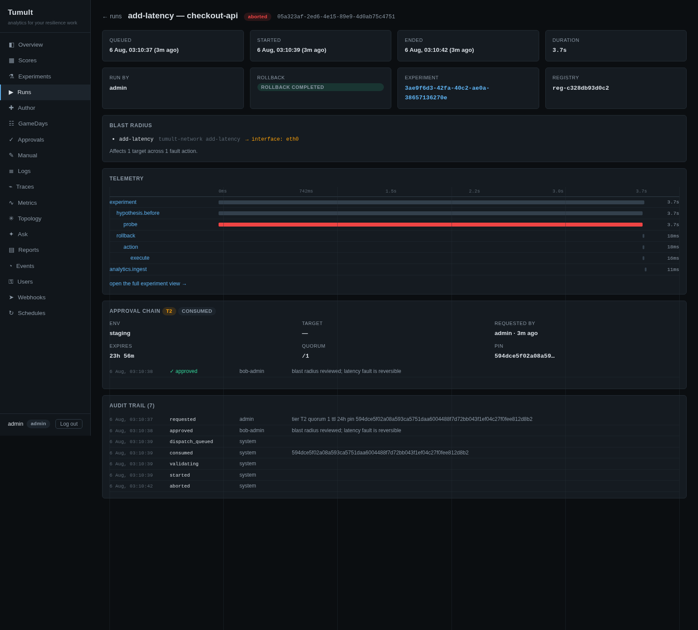

## E-stop mid-method

A second run — a rolling-sleep definition — is stopped mid-method. The
two-step e-stop is deliberate: the first click arms, the confirm halts the
run before the next activity and unwinds rollbacks.

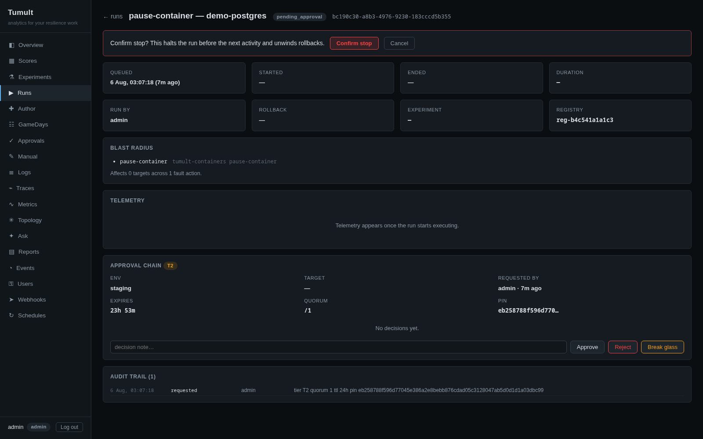

The result: state `aborted`, the fault span cut short (the long red action
span), `stop_requested` attributed to the operator in the audit trail, and
rollback completed — the marker file the fault created is gone.

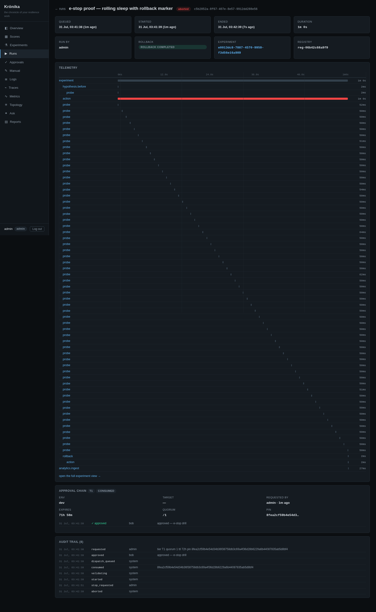

## Evidence pack

Finally, the compliance story: R1 executive digests, R2 evidence packs
(DORA/NIS2/ISO 27001/SOC 2), and R3 game-day reports are generated from the
store as document-controlled PDFs. The R2 pack includes the approval chain of
every gated run in the window (SOC 2 CC8.1) — the two runs above, bob's
approvals included.

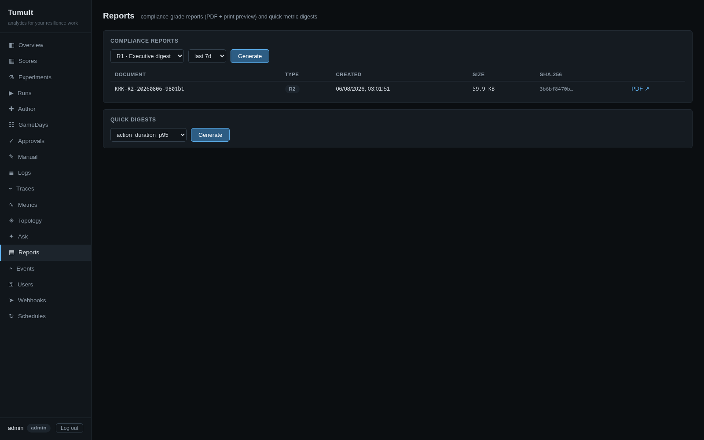

## Where next

- [Krönika architecture](../architecture/kronika-architecture.md) — the
  single-writer lake, run queue, approval pinning, and report pipeline behind
  these screens.
- [Production deployment](production-deployment.md) — binaries, containers,
  hardening.
- [CLI reference](cli-reference.md) — the same loop from the command line.
