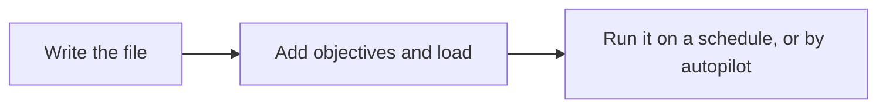

# Run experiments

Write an experiment, say what it must meet, put load on the system while it
runs, and run it on a timer or behind a policy.

```mermaid
flowchart LR
    accTitle: From a file to repeated runs
    accDescr: Write the experiment file, add objectives and load, then run it on a schedule or let autopilot run it.
    write[Write the file] --> measure[Add objectives and load]
    measure --> repeat[Run it on a schedule, or by autopilot]
```
